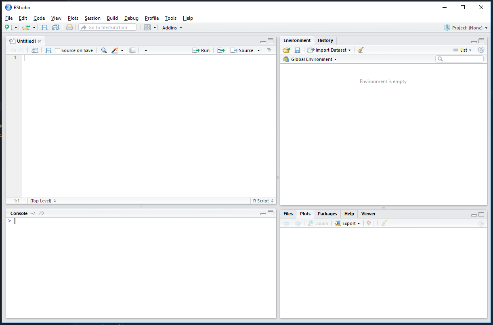
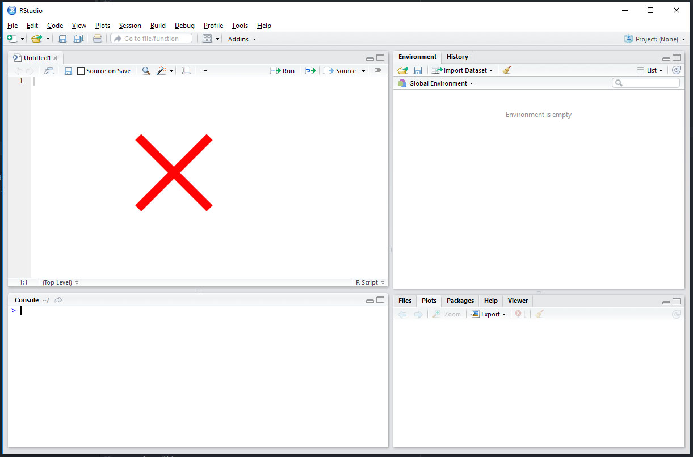
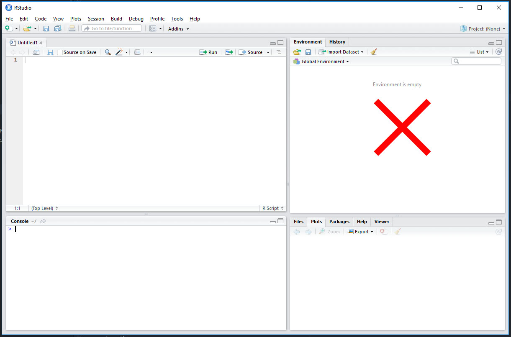
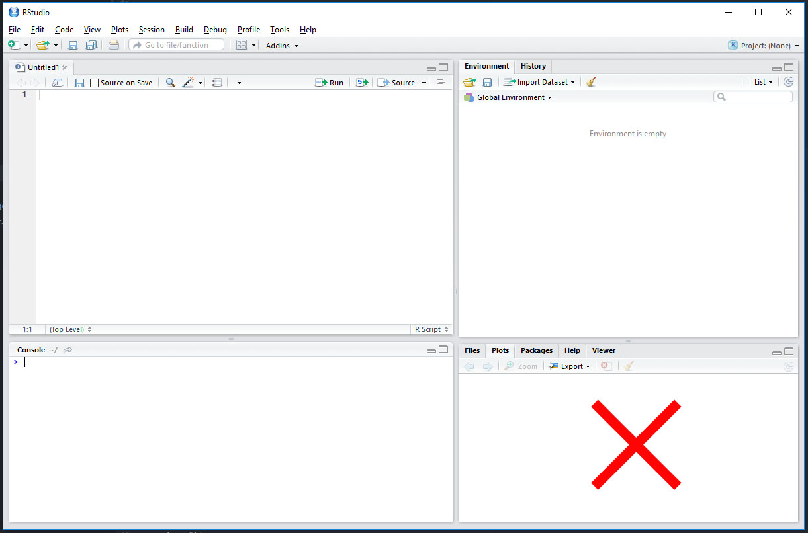
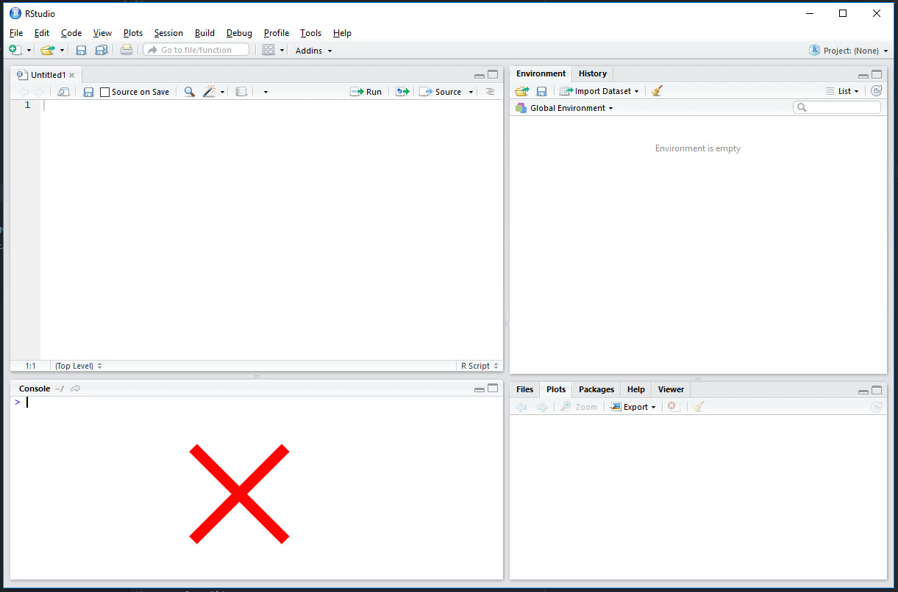
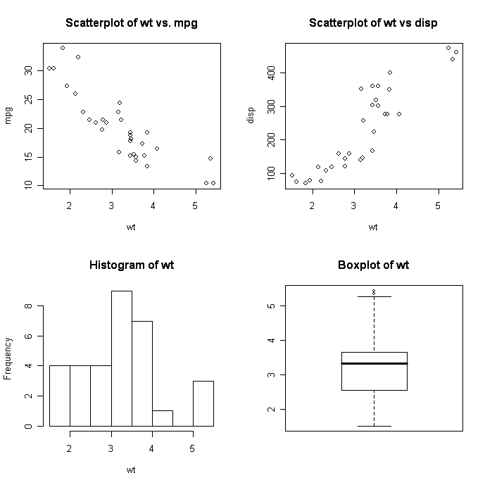
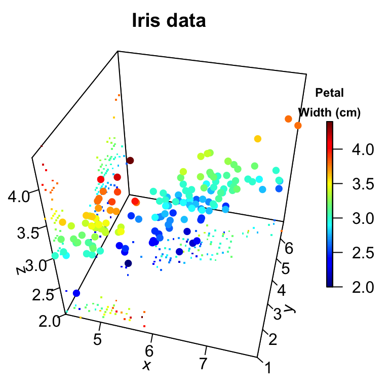
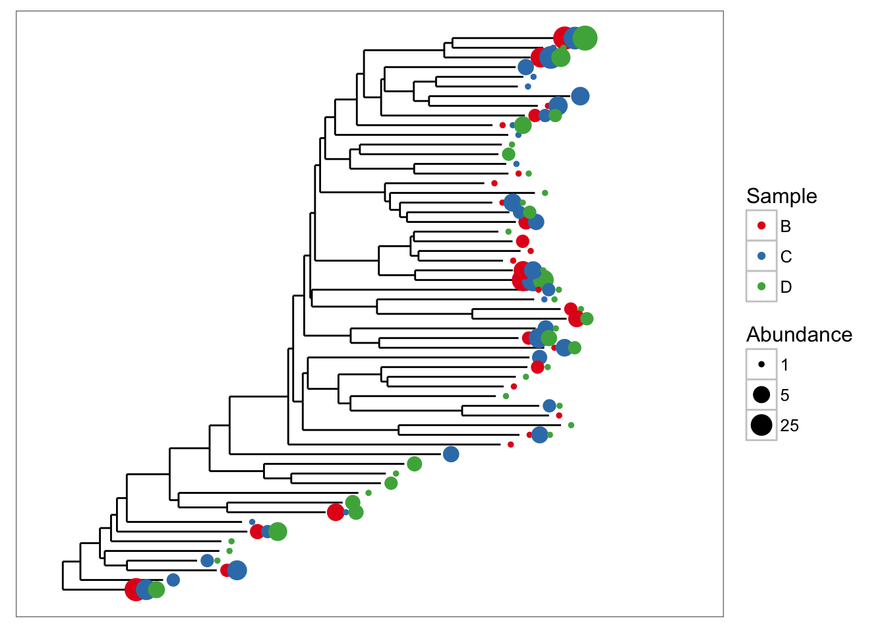
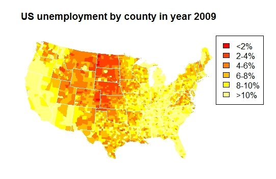

## Why R?

- It's free
- Customizable, extensible
- An abundance of libraries
- Full programming language
- Collaboration with colleagues
- Support for reproducible analysis
- Methods of publishing code and results

And much more.

---  .class #id &twocol

## What is R?

R refers to the progamming language and software environment

*** =left
RStudio =/= R

- R is the engine
- R studio is the dashboard and steering wheel- point 1

Many functions are in packages/libraries which must be installed and loaded
- Reinstall for each version of R
*** =right
<div style='text-align: center;'>
    </img>
</div>
  
<div style='text-align: center;'>
    </img>
</div>


--- .class #id

## The R Studio GUI

<div style='text-align: center;'>
    </img>
</div>

--- .class #id

## The R Studio GUI - Code

<div style='text-align: center;'>
    </img>
</div>

--- .class #id

## The R Studio GUI - Environment

<div style='text-align: center;'>
    </img>
</div>

--- .class #id

## The R Studio GUI - Files, Plots, Packages, etc.

<div style='text-align: center;'>
    </img>
</div>

--- .class #id

## The R Studio GUI - Console

<div style='text-align: center;'>
    </img>
</div>

--- .class #id

## What can we do with R?

- Simple calculations
- Data cleaning and organisation
- Simple stats tests
- Advanced stats tests
- Complex models
- Phylogenetic analyses
- Network analyses
- Spatial analysis

And much more.

--- .class #id

## Examples

Data exploration

<div style='text-align: center;'>
    </img>
</div>

--- .class #id

## Examples

3D plots

<div style='text-align: center;'>
    </img>
</div>

--- .class #id

## Examples

Kernel Density Estimation

<div style='text-align: center;'>
    </img>
</div>

--- .class #id

## Examples

Tree plots

<div style='text-align: center;'>
    </img>
</div>

--- .class #id

## Examples

Mapping

<div style='text-align: center;'>
    </img>
</div>

--- .class #id

## Setting your work environment

Before beginning work in R, you should specify your working directory. This is the root directory which contains all files and subfolders relevant to your analyses. E.g.

```{r}
setwd("C:/Users/Anthony Caravaggi/Dropbox/GitHub/BL6024_UCC_2017/Lecture 01")
```

Make sure that your slashes are going in the correct directio (almost always the opposite of most other commonly-used programs)

--- .class #id

## R Console

In the R console, you can enter numbers, perform calculations, and run code.

```{r}
3 + 5
3 - 5
3 * 5
```

--- .class #id

## Saving code

Any code entered in the Console will **not** be saved. All code should be entered in the code window and the file saved. 

<div style='text-align: center;'>
    </img>
</div>

--- .class #id

## Commenting on code

Be sure to comment on your code for future reference and to ease replication by other users.

```{r}
# Anything preceded by hashtags is ignored by R
# Hashtags don't flow to the next line!
# An example comment would be:

# Finding the square root of integers as an example of basic R functionality
sqrt(34 + 12)
```

Comments do not have to be wordy or complex but **must** be clear.

--- .class #id

## Assigning variables

Any data entered or calculations performed which are not assigned to variables (objects) will **not** be saved.

```{r}
x <- 3 + 5
x = 3 + 5
x
```

--- .class #id

## Assigning objects

Lists of integers or characters (strings) can be stored as objects

```{r}
x <- c(2, 4, 6, 8, 10)
y <- c("two", "four", "six", "eight", "ten")
x
y
```

c = combine/concatenate; this creates a list or unidimensional object (vector)

--- .class #id

## Sequences and repetition

```{r}
a <- c(1:10)
b <- seq(1,10, by = 0.5)
a
b
```

--- .class #id

## Sequences and repetition

```{r}
c <- rep(5,10)
d <- rep(c("A","B","C"),2)
c
d
```

--- .class #id

## Extracting data

4th element of vector a (first element is element 1)

```{r}
a[4] 
```

Second and fifth element of b

```{r}
b[c(2,5)]
```

--- .class #id

## Calculations with objects

Numeric objects can be adjusted according to a single number

```{r}
x <- c(2, 4, 6, 8, 10)
x + 1
```

Or pairwise, by another object

```{r}
x <- c(2, 4, 6, 8, 10)
y <- c(1, 2, 3, 4, 5)
x/y
```

--- .class #id

## Mathematical operators

To take the square root, find e raised to each number, etc., use the usual commands 

```{r}
sqrt(x)
exp(x)
log(x)
```

--- .class #id

## Mathematical operators

By combining operations and using parentheses you can make more complicated expressions

```{r}
c <- (x + sqrt(x))/(exp(x)+1)
c
```

--- .class #id

## Logical operators

```{r}
3 + 5 == 8 # equal to
3 + 5 != 9 # not equal to
3 + 5 >= 8 # greater than or equal to
3 + 5 < 12 # less than
```

--- .class #id

## Vector length

When you do operations on vectors they are performed on an element by element basis. All of the vectors in an expression must be the same length. 

```{r}
a <- c(1,2,3)
b <- c(10,11,12,13)
a+b
```

--- .class #id  

## Accounting for Class

Certain functions cannot be applied to certain data classes. To find out the class of your data:

```{r}
x <- c(2, 4, 6, 8, 10)
y <- c("two", "four", "six", "eight", "ten")
class(x)
class(y)
```

--- .class #id

## Accounting for Class

For example, you cannot use arthimetic with a character object

```{r}
x + y
```

--- .class #id

## Descriptive statistics

Simple commands can be used to derive basic descriptive statistics for objects

```{r}
x <- c(2, 4, 6, 8, 10)
mean(x)
summary(x)
```

--- .class #id

## Exercise

Explore arthimetic and creating vectors in R.

--- .class #id

## Data frames

A data frame is a collection of related objects. They can be created manually (here an example based on blue tits (*Cyanistes caeruleus*)...

```{r}
sp <- rep("BLUTI", 50) # repeat a string or number x times
wi <- sample(57:69, 50, replace=TRUE) # generate a vector of given length between integers
we <- runif(50, min=8, max=13) # as above, but allows generation of decimal data
btDat <- data.frame(sp, wi, we)
head(btDat)
```

--- .class #id

## Data frames

Data can also be read from external files. csv and txt are the easiest and most frequently used. Here  we have a dataset based on great tits (*Parus major*)

```{r}
gtDat <- read.csv("assets/img/gtDat.csv", header = TRUE, row.names = 1)
summary(gtDat)
```

--- .class #id

## Data frame attributes

```{r}
names(btDat)
colnames(btDat)
class(btDat)
```

--- .class #id

## Data frame attributes

```{r}
attributes(btDat)
```

--- .class #id

## Data frames

We can use the same commands to explore or manipulate the data as we would with individual objects. We use **$** to specify columns in a data frame.

```{r}
mean(btDat$wi)
max(btDat$we)
```

--- .class #id

## Data frames - plotting data

```{r}
plot(btDat$wi, btDat$we)
```

--- .class #id

```{r}
hist(btDat$we)
```

--- .class #id

## Extract values from data frame

```{r}
btDat[,3] # 4th column of matrix
btDat[4,] # 4th row of matrix
```

--- .class #id

## Extract values from data frame

```{r}
btDat[2:4,1:3] # rows 2-4 of columns 1-3
```

--- .class #id

## Factors

Sometimes an experiment includes different levels of some explanatory variable. The different levels are also called factors. Factors are treated differently than ordinary vectors.

```{r}
x <- sample(4:10, 50, replace=TRUE)
summary(x)
x <- factor(x)
summary(x)
```

--- .class #id

## Two-way tables

```{r}
a <- c("Hungry","Fed","Hungry","Hungry","Fed","Hungry","Fed","Fed")
b <- c("Yes","No","Yes","Yes","No","No","Yes","No")
t <- table(a,b)
t
```

The table command allows us to do a very quick calculation, and gives us a quick overview of the data.

--- .class #id

## Two-way tables

Tables can also be entered manually.

```{r}
bDat <-matrix(c(34, 12, 41, 7),ncol=2,byrow=TRUE)
rownames(bDat)<-c("male","female")
colnames(bDat)<-c("robin","goldc")
bDat <- as.table(bDat)
bDat
```

The byrow=TRUE option indicates that the numbers are filled in across the rows first, and the ncols=2 indicates that there are two columns.

--- .class #id

## Exercise

Generate two character and four numerical vectors

Combine these vectors into a data frame

Explore these data to retrieve summary statistics and plots

--- .class #id

## Exercise

Download the data file `tDat` from the link, below

**LINK**

Read the csv and explore the data. Answer the following questions:
- How many species are detailed in these data?
- What is the name of the third column?
- What is the value of the data in the 2nd column, 57th row?
- What data are on the 5th, 12th and 87th rows?
- What is the median of the second column?
- What is the square root of the value in the 3rd column, 70th row?

--- .class #id

## Packages

A bundle of code, data, documentation, and tests developed by the community
- Easy to share
- Often stored on repositories (repos)
- Over 10,000 packages on the Comprehensive R Archive Network, or CRAN
- Stored in your R library

Which package do I use?
- Refer to papers using the same analyses
- Refer to CRAN's index (https://cran.r-project.org/web/views/)

Install from CRAN with `install.packages("x")`  
Use in R with `library("x")`  
Get help with `package?x` and `help(package = "x")`  

--- .class #id

## Troubleshooting and getting help

Use the help menu in the bottom right pane, or `help.start()`  
Use the `help()` command, e.g. `help(print)`  
Use package vignettes
- How-to guides for topics with simple introductions and examples
- To get a list of all available vignettes type `vignette()` 
- Use the `openVignette()` command to open it  

R Cookbook - http://www.cookbook-r.com/     
R Reference Card - https://cran.r-project.org/doc/contrib/Short-refcard.pdf  
RStudio Cheat Sheets - https://www.rstudio.com/resources/cheatsheets/   

Books

--- .class #id

## Troubleshooting and getting help 

Google  
Stack Overflow - https://stackoverflow.com/questions/tagged/r  
Reddit - http://www.reddit.com/r/rstats  
Facebook - R-Space (https://www.facebook.com/groups/308600982528221)  

`UCC R Stats Mailing List`    
https://github.com/arcaravaggi/BL6024_UCC_2017/blob/master/UCCRstats_list_intro.md 

Join the list by sending a blank email to `UCCRSTATS-L-subscribe-request@lists.ucc.ie`

---
