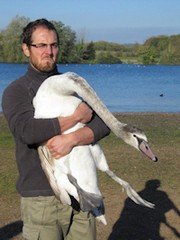
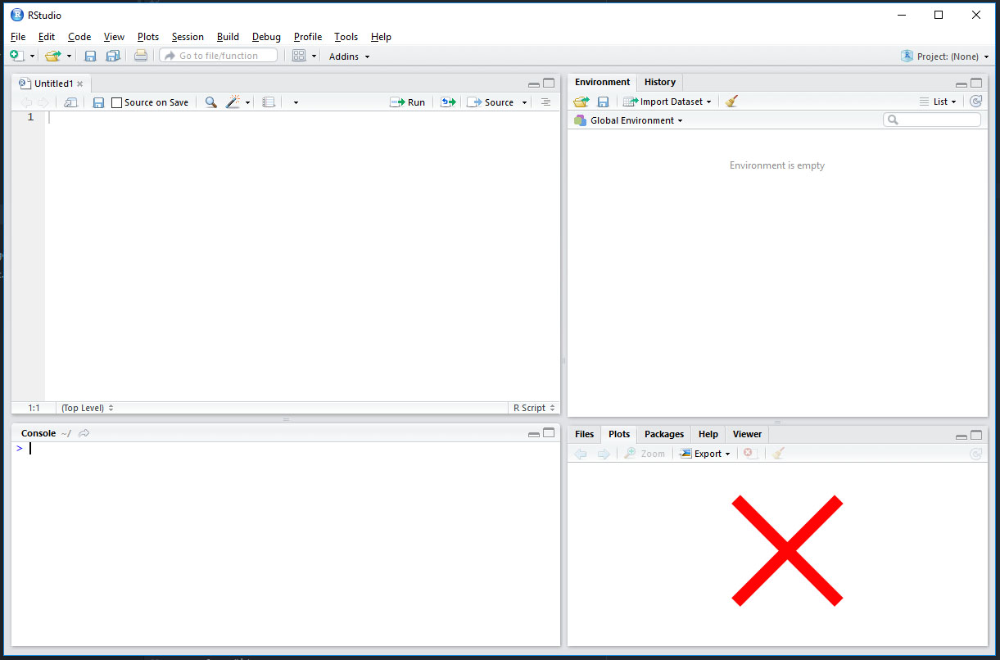
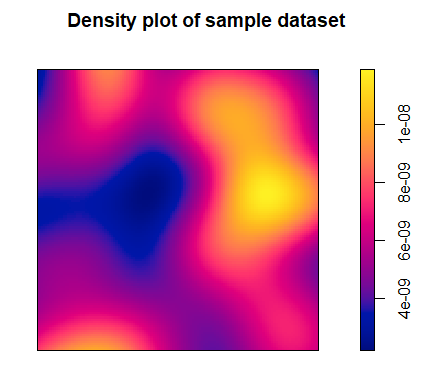
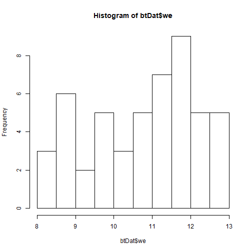

## Required software

R  
Available at https://cran.r-project.org/mirrors.html  
  
R studio  
Available at https://www.rstudio.com/


--- .class #id &twocol

## Course tutors

*** =left

<div style='text-align: left;'>
    </img>
    Tom Reed
</div>   
.  
<div style='text-align: left;'>
    </img>
    Javi Del barco-Trillo
</div> 
.  
<div style='text-align: left;'>
    </img>
    Adam Kane
</div> 
*** =right
<div style='text-align: left;'>
    </img>
    Emma Critchley
</div> 
.  
<div style='text-align: left;'>
    </img>
    James Savage
</div> 
.  
<div style='text-align: left;'>
    </img>
    Anthony Caravaggi
</div> 

--- .class #id

## Suggested reading

<div style='text-align: center;'>
    </img>
</div> 

--- .class #id

## Why R?

- It's free
- Customizable, extensible
- An abundance of libraries
- Full programming language
- Collaboration with colleagues
- Support for reproducible analysis
- Methods of publishing code and results
- Distributable computing

And much more.

---  .class #id &twocol

## What is R?

R refers to the progamming language and software environment

*** =left
RStudio =/= R

- R is the engine
- R studio is the dashboard and steering wheel- point 1

Many functions are in packages/libraries which must be installed and loaded
- Reinstall for each version of R
*** =right
<div style='text-align: center;'>
    </img>
</div>
  
<div style='text-align: center;'>
    </img>
</div>


--- .class #id

## The R Studio GUI

<div style='text-align: center;'>
    </img>
</div>

--- .class #id

## The R Studio GUI - Code

<div style='text-align: center;'>
    </img>
</div>

--- .class #id

## The R Studio GUI - Environment

<div style='text-align: center;'>
    </img>
</div>

--- .class #id

## The R Studio GUI - Files, Plots, Packages, etc.

<div style='text-align: center;'>
    </img>
</div>

--- .class #id

## The R Studio GUI - Console

<div style='text-align: center;'>
    </img>
</div>

--- .class #id

## What can we do with R?

- Simple calculations
- Data cleaning and organisation
- Simple stats tests
- Advanced stats tests
- Complex models
- Phylogenetic analyses
- Network analyses
- Spatial analysis

And much more.

--- .class #id

## Examples

Data exploration

<div style='text-align: center;'>
    </img>
</div>

--- .class #id

## Examples

3D plots

<div style='text-align: center;'>
    </img>
</div>

--- .class #id

## Examples

Kernel Density Estimation

<div style='text-align: center;'>
    </img>
</div>

--- .class #id

## Examples

Tree plots

<div style='text-align: center;'>
    </img>
</div>

--- .class #id

## Examples

Mapping

<div style='text-align: center;'>
    </img>
</div>

--- .class #id

## Setting your work environment

Before beginning work in R, you should specify your working directory. This is the root directory which contains (and will contain) all files and subfolders relevant to your analyses. 


```r
setwd("C:/Users/Anthony Caravaggi/Dropbox/GitHub/BL6024_UCC_2017/Lecture 01")
```

--- .class #id

## R Console

In the R console, you can enter numbers, perform calculations, and run code.


```r
3 + 5
```

```
## [1] 8
```

```r
3 - 5
```

```
## [1] -2
```

```r
3 * 5
```

```
## [1] 15
```

--- .class #id

## Saving code

Any code entered in the Console will **not** be saved. All code should be entered in the code window and the file saved. 

<div style='text-align: center;'>
    </img>
</div>

--- .class #id

## Commenting on code

Be sure to comment on your code for future reference and to ease replication by other users.


```r
# Anything preceded by hashtags is ignored by R
# Hashtags don't flow to the next line!
# An example comment would be:

# Finding the square root of integers as an example of basic R functionality
sqrt(34 + 12)
```

```
## [1] 6.78233
```

Comments do not have to be wordy or complex but **must** be clear.

--- .class #id

## Assigning variables


```r
x <- 3 + 5
x = 3 + 5
x
```

```
## [1] 8
```

The "<-" or "=" tells R to take the equation to the right of the symbol and store it in a variable whose name is given on the left.

Any data entered or calculations performed which are not assigned to variables will **not** be saved.

--- .class #id

## Vectors

Lists of integers or characters (strings) can be stored. These are known as vectors.


```r
x <- c(2, 4, 6, 8, 10)
y <- c("two", "four", "six", "eight", "ten")
x
```

```
## [1]  2  4  6  8 10
```

```r
y
```

```
## [1] "two"   "four"  "six"   "eight" "ten"
```

--- .class #id

## Sequences and repetition


```r
a <- c(1:10)
b <- seq(1,10, by = 0.5)
a
```

```
##  [1]  1  2  3  4  5  6  7  8  9 10
```

```r
b
```

```
##  [1]  1.0  1.5  2.0  2.5  3.0  3.5  4.0  4.5  5.0  5.5  6.0  6.5  7.0  7.5
## [15]  8.0  8.5  9.0  9.5 10.0
```

--- .class #id

## Sequences and repetition


```r
c <- rep(5,10)
d <- rep(c("A","B","C"),2)
c
```

```
##  [1] 5 5 5 5 5 5 5 5 5 5
```

```r
d
```

```
## [1] "A" "B" "C" "A" "B" "C"
```

--- .class #id

## Random numbers

For a vector of 5 numbers

```r
runif(5)
```

```
## [1] 0.11734613 0.53773981 0.13314183 0.45072312 0.06792998
```

5 numbers between 5 and 20

```r
runif(5, min=5, max=20)
```

```
## [1]  5.669534 10.170092 11.389840 19.665348  7.642187
```

Similarly

```r
sample(5:20, 5, replace=TRUE)
```

```
## [1]  8 16  5 15 15
```

--- .class #id

To generate random numbers from a normal distribution

```r
rnorm(5)
```

```
## [1] 1.00511103 0.02999644 0.63816588 0.35088240 1.17454193
```

With a specfied mean and standard deviation

```r
rnorm(5, mean=6, sd=1.2)
```

```
## [1] 7.229276 5.422180 5.037910 4.689769 3.847081
```

To make your random numbers repeatable, use set.seed

```r
set.seed(42)
rnorm(5, mean=6, sd=1.2)
```

```
## [1] 7.645150 5.322362 6.435754 6.759435 6.485122
```


--- .class #id

## Extracting data

4th element of vector a (first element is element 1)


```r
a[4] 
```

```
## [1] 4
```

Second and fifth element of b


```r
b[c(2,5)]
```

```
## [1] 1.5 3.0
```

--- .class #id

## Calculations with objects

Numeric objects can be adjusted according to a single number


```r
x <- c(2, 4, 6, 8, 10)
x + 1
```

```
## [1]  3  5  7  9 11
```

Or pairwise, by another object


```r
x <- c(2, 4, 6, 8, 10)
y <- c(1, 2, 3, 4, 5)
x/y
```

```
## [1] 2 2 2 2 2
```

--- .class #id

## Mathematical operators

To take the square root, find e raised to each number, etc., use the usual commands 


```r
sqrt(x)
```

```
## [1] 1.414214 2.000000 2.449490 2.828427 3.162278
```

```r
exp(x)
```

```
## [1]     7.389056    54.598150   403.428793  2980.957987 22026.465795
```

```r
log(x)
```

```
## [1] 0.6931472 1.3862944 1.7917595 2.0794415 2.3025851
```

--- .class #id

## Mathematical operators

By combining operations and using parentheses you can make more complicated expressions


```r
c <- (x + sqrt(x))/(exp(x)+1)
c
```

```
## [1] 0.4069842330 0.1079172598 0.0208924040 0.0036313144 0.0005975394
```

--- .class #id

## Logical operators


```r
3 + 5 == 8 # equal to
```

```
## [1] TRUE
```

```r
3 + 5 != 9 # not equal to
```

```
## [1] TRUE
```

```r
3 + 5 >= 8 # greater than or equal to
```

```
## [1] TRUE
```

```r
3 + 5 < 12 # less than
```

```
## [1] TRUE
```

--- .class #id

## Vector length

When you do operations on vectors they are performed on an element by element basis. All of the vectors in an expression must be the same length, or else the shorter vector will loop. 


```r
a <- c(1,2,3)
b <- c(10,11,12,13)
a+b
```

```
## Warning in a + b: longer object length is not a multiple of shorter object
## length
```

```
## [1] 11 13 15 14
```

--- .class #id  

## Accounting for Class

Certain functions cannot be applied to certain data classes. To find out the class of your data:


```r
x <- c(2, 4, 6, 8, 10)
y <- c("two", "four", "six", "eight", "ten")
class(x)
```

```
## [1] "numeric"
```

```r
class(y)
```

```
## [1] "character"
```

--- .class #id

## Accounting for Class

For example, you cannot use arthimetic with a character object


```r
x + y
```

```
## Error in x + y: non-numeric argument to binary operator
```

You can change a vector's class, but be careful - this can have implications elsewhere in your code!


```r
x2 <- as.character(x)
class(x2)
```

```
## [1] "character"
```

--- .class #id

## Descriptive statistics

Simple commands can be used to derive basic descriptive statistics for objects


```r
x <- c(2, 4, 6, 8, 10)
mean(x)
```

```
## [1] 6
```

```r
summary(x)
```

```
##    Min. 1st Qu.  Median    Mean 3rd Qu.    Max. 
##       2       4       6       6       8      10
```

--- .class #id

## Factors

Sometimes an experiment includes different levels of some explanatory variable. The different levels are also called factors. Factors are treated differently than ordinary vectors. For example, when you use `summary` on a factor,it prints out the possible values and their frequencies rather than the five-point summary.


```r
x <- sample(4:10, 50, replace=TRUE)
summary(x)
```

```
##    Min. 1st Qu.  Median    Mean 3rd Qu.    Max. 
##     4.0     6.0     7.0     7.4     9.0    10.0
```

```r
x <- factor(x)
summary(x)
```

```
##  4  5  6  7  8  9 10 
##  7  4  6  9  5  7 12
```


--- .class #id

## Exercise

Explore arthimetic and creating vectors in R.

--- .class #id

## Data frames

A data frame is a collection of related objects. They can be created manually (here an example based on blue tits (*Cyanistes caeruleus*)...


```r
sp <- rep("BLUTI", 50) # repeat a string or number x times
wi <- sample(57:69, 50, replace=TRUE) # generate a vector of given length between integers
we <- runif(50, min=8, max=13) # as above, but allows generation of decimal data
btDat <- data.frame(sp, wi, we)
head(btDat)
```

```
##      sp wi       we
## 1 BLUTI 65 11.04469
## 2 BLUTI 69 12.18401
## 3 BLUTI 66 11.75761
## 4 BLUTI 64 10.26366
## 5 BLUTI 68 10.67895
## 6 BLUTI 59 10.68688
```

--- .class #id

All values of the same variable **must** be contained within the same column


```
##   cold warm  hot
## 1 13.4  9.5 21.0
## 2 18.1 12.3 18.3
## 3 11.9 10.4 17.6
```

This is not a dataframe. 

A dataframe based on these data would need two columns:
- Levels (cold, warm, hot)
- Response (measurments)

--- .class #id


```r
library(reshape2)
v2 <- melt(v)
```

```
## No id variables; using all as measure variables
```

```r
colnames(v2) <- c("temperature", "r_time")
v2
```

```
##   temperature r_time
## 1        cold   13.4
## 2        cold   18.1
## 3        cold   11.9
## 4        warm    9.5
## 5        warm   12.3
## 6        warm   10.4
## 7         hot   21.0
## 8         hot   18.3
## 9         hot   17.6
```

--- .class #id

## Data frames

Data can also be read from external files. csv and txt are the easiest and most frequently used. Here  we have a dataset based on great tits (*Parus major*)


```r
gtDat <- read.csv("assets/img/gtDat.csv", header = TRUE, row.names = 1)
summary(gtDat)
```

```
##      sp           wi              we       
##  GRETI:50   Min.   :69.00   Min.   :15.20  
##             1st Qu.:70.25   1st Qu.:16.61  
##             Median :73.50   Median :17.79  
##             Mean   :74.08   Mean   :17.97  
##             3rd Qu.:77.00   3rd Qu.:19.37  
##             Max.   :81.00   Max.   :20.98
```

--- .class #id


```r
str(gtDat)
```

```
## 'data.frame':	50 obs. of  3 variables:
##  $ sp: Factor w/ 1 level "GRETI": 1 1 1 1 1 1 1 1 1 1 ...
##  $ wi: int  70 75 70 74 69 69 73 74 81 71 ...
##  $ we: num  16.4 16 19.1 20.8 17.1 ...
```


```r
dim(gtDat)
```

```
## [1] 50  3
```

--- .class #id

## Data frame attributes


```r
names(btDat)
```

```
## [1] "sp" "wi" "we"
```

```r
colnames(btDat)
```

```
## [1] "sp" "wi" "we"
```

```r
class(btDat)
```

```
## [1] "data.frame"
```

--- .class #id

## Data frame attributes


```r
attributes(btDat)
```

```
## $names
## [1] "sp" "wi" "we"
## 
## $row.names
##  [1]  1  2  3  4  5  6  7  8  9 10 11 12 13 14 15 16 17 18 19 20 21 22 23
## [24] 24 25 26 27 28 29 30 31 32 33 34 35 36 37 38 39 40 41 42 43 44 45 46
## [47] 47 48 49 50
## 
## $class
## [1] "data.frame"
```

--- .class #id

## Data frames

We can use the same commands to explore or manipulate the data as we would with individual objects. We use **$** to specify columns in a data frame.


```r
mean(btDat$wi)
```

```
## [1] 62.7
```

```r
max(btDat$we)
```

```
## [1] 12.81285
```

--- .class #id

We can also derive estimates for different levels within a dataframe. 


```r
tDat <- read.csv("assets/img/tDat.csv", header = TRUE, stringsAsFactors=FALSE)
head(tDat)
```

```
##      ï..Date  Code      Sp_C          Sp_L Type Age Sex Wing Weight
## 1 19/06/2011 BLABI Blackbird Turdus merula    N   3  JM  135   98.8
## 2 01/07/2011 BLABI Blackbird Turdus merula    R   3   J  126   88.4
## 3 01/07/2011 BLABI Blackbird Turdus merula    N   3   J  127   89.8
## 4 07/08/2011 BLABI Blackbird Turdus merula    N   3   J  132   91.1
## 5 07/08/2011 BLABI Blackbird Turdus merula    N   3   J  131   95.3
## 6 13/08/2011 BLABI Blackbird Turdus merula    N   3   M  129  101.3
```


--- .class #id


```r
summary(tDat)
```

```
##    ï..Date              Code               Sp_C          
##  Length:317         Length:317         Length:317        
##  Class :character   Class :character   Class :character  
##  Mode  :character   Mode  :character   Mode  :character  
##                                                          
##                                                          
##                                                          
##      Sp_L               Type                Age            Sex           
##  Length:317         Length:317         Min.   :1.000   Length:317        
##  Class :character   Class :character   1st Qu.:3.000   Class :character  
##  Mode  :character   Mode  :character   Median :4.000   Mode  :character  
##                                        Mean   :4.237                     
##                                        3rd Qu.:5.000                     
##                                        Max.   :6.000                     
##       Wing            Weight      
##  Min.   : 23.00   Min.   :  6.60  
##  1st Qu.: 61.00   1st Qu.: 10.20  
##  Median : 68.00   Median : 15.90  
##  Mean   : 74.16   Mean   : 25.51  
##  3rd Qu.: 75.00   3rd Qu.: 18.80  
##  Max.   :163.00   Max.   :190.00
```

--- .class #id


```r
by(tDat, tDat$Sp_C, function(x) {mean.w <- mean(x$Weight)})
```

```
## tDat$Sp_C: Blackbird
## [1] 94.74444
## -------------------------------------------------------- 
## tDat$Sp_C: Blackcap
## [1] 23.1
## -------------------------------------------------------- 
## tDat$Sp_C: Blue tit
## [1] 10.48929
## -------------------------------------------------------- 
## tDat$Sp_C: Chiffchaff
## [1] 7.9225
## -------------------------------------------------------- 
## tDat$Sp_C: Great tit
## [1] 17.89367
## -------------------------------------------------------- 
## tDat$Sp_C: Green woodpecker
## [1] 190
## -------------------------------------------------------- 
## tDat$Sp_C: Robin
## [1] 18.46842
## -------------------------------------------------------- 
## tDat$Sp_C: Wren
## [1] 10.23448
```

--- .class #id

## Data frames - plotting data


```r
plot(tDat$Wing, tDat$Weight)
```


--- .class #id


```r
hist(btDat$we)
```



--- .class #id

## Extract values from data frame


```r
btDat[,3] # 4th column of matrix
```

```
##  [1] 11.044687 12.184008 11.757613 10.263658 10.678950 10.686883  8.006904
##  [8]  9.778330 11.060665 12.144711  9.783610 10.053176 10.867379 10.948392
## [15] 11.598286  9.974865 12.596020 12.812851  9.167618 11.622488 12.518173
## [22] 11.017370 11.157536 12.686929 12.252414 10.899104 12.107020  8.568593
## [29] 11.822539 11.118067  8.742233  8.401322 10.320348 11.896841 11.667640
## [36] 12.086152  8.850812 12.723602  9.468119  8.745360 11.596893  9.620430
## [43] 11.894047  9.972205 11.392964 11.879125  8.939345  8.145429  8.678569
## [50] 11.400821
```

```r
btDat[4,] # 4th row of matrix
```

```
##      sp wi       we
## 4 BLUTI 64 10.26366
```

--- .class #id

## Extract values from data frame


```r
btDat[2:4,1:3] # rows 2-4 of columns 1-3
```

```
##      sp wi       we
## 2 BLUTI 69 12.18401
## 3 BLUTI 66 11.75761
## 4 BLUTI 64 10.26366
```

We can also `subset` our data, to extract rows containing specific values.


```r
tDat[tDat$Sp_C == "Green woodpecker", ]
```

```
##        ï..Date  Code             Sp_C          Sp_L Type Age Sex Wing
## 249 26/06/2011 GREWO Green woodpecker Picus viridis    N   6   F  163
##     Weight
## 249    190
```

--- .class #id

We can also base subsets on multiple options.


```r
cchaff <- tDat[ which(tDat$Sp_L=='Phylloscopus collybita' & tDat$Age == 4), ]
cchaff
```

```
##        ï..Date  Code       Sp_C                   Sp_L Type Age Sex Wing
## 157 23/04/2011 CHIFF Chiffchaff Phylloscopus collybita    N   4   M   61
## 158 23/04/2011 CHIFF Chiffchaff Phylloscopus collybita    N   4   M   62
## 159 26/06/2011 CHIFF Chiffchaff Phylloscopus collybita    N   4       61
## 160 07/08/2011 CHIFF Chiffchaff Phylloscopus collybita    N   4   F   54
## 161 14/07/2012 CHIFF Chiffchaff Phylloscopus collybita    N   4   F   54
## 162 12/05/2013 CHIFF Chiffchaff Phylloscopus collybita    N   4   M   64
## 163 20/06/2014 CHIFF Chiffchaff Phylloscopus collybita    N   4   F   61
## 164 23/05/2015 CHIFF Chiffchaff Phylloscopus collybita    N   4       68
## 165 23/05/2015 CHIFF Chiffchaff Phylloscopus collybita    N   4   M   64
##     Weight
## 157    8.2
## 158    7.8
## 159    7.7
## 160    7.1
## 161    6.8
## 162    8.6
## 163    8.4
## 164    8.6
## 165    7.8
```

--- .class #id


```r
robin <- tDat[ which(tDat$Code=='ROBIN' & tDat$Age == 3 & tDat$Weight >= 18), ]
robin
```

```
##        ï..Date  Code  Sp_C               Sp_L Type Age Sex Wing Weight
## 254 28/05/2004 ROBIN Robin Erithacus rubecula    N   3   J   71   18.3
## 255 28/05/2004 ROBIN Robin Erithacus rubecula    N   3   J   73   18.2
## 256 11/12/2010 ROBIN Robin Erithacus rubecula    R   3       71   18.2
## 257 11/12/2010 ROBIN Robin Erithacus rubecula    R   3       75   19.3
## 259 26/06/2011 ROBIN Robin Erithacus rubecula    N   3   J   73   19.0
## 260 01/07/2011 ROBIN Robin Erithacus rubecula    N   3   J   72   18.7
## 262 07/08/2011 ROBIN Robin Erithacus rubecula    R   3   J   73   18.8
## 263 19/05/2012 ROBIN Robin Erithacus rubecula    N   3   J   72   18.2
## 264 27/07/2013 ROBIN Robin Erithacus rubecula    N   3   J   73   19.7
## 267 22/09/2013 ROBIN Robin Erithacus rubecula    N   3   J   71   19.2
## 268 20/06/2014 ROBIN Robin Erithacus rubecula    N   3   J   75   18.4
```

--- .class #id

## Matrix

Matrices are data arranged in a two-dimensional, rectangular layout, where all cell types are the same


```r
a <- c("Hungry","Fed","Hungry","Hungry","Fed","Hungry","Fed","Fed")
b <- c("Yes","No","Yes","Yes","No","No","Yes","No")
t <- table(a,b)
t
```

```
##         b
## a        No Yes
##   Fed     3   1
##   Hungry  1   3
```

The table command allows us to do a very quick combination, and gives us a quick overview of the data.

--- .class #id


Matrices can also be entered manually.


```r
cDat <-matrix(c(34, 12, 41, 7),ncol=2,byrow=TRUE)
rownames(cDat)<-c("male","female")
colnames(cDat)<-c("robin","goldc")
cDat <- as.table(cDat)
cDat
```

```
##        robin goldc
## male      34    12
## female    41     7
```

The byrow=TRUE option indicates that the numbers are filled in across the rows first, and the ncols=2 indicates that there are two columns.


--- .class #id

## Lists

Lists are vectors containing other objects

```r
lis <- list(l1 = 1:10, l2 = seq(0, 1, length.out = 5))
lis
```

```
## $l1
##  [1]  1  2  3  4  5  6  7  8  9 10
## 
## $l2
## [1] 0.00 0.25 0.50 0.75 1.00
```

--- .class #id

## Tidying and saving

You can save your dataframes to csv or text files


```r
write.csv(cchaff, "chiffchaff_data.csv")
```

You can remove any objects from your working environment using the `rm` command


```r
rm(cchaff)
rm(robin, greti)
```

```
## Warning in rm(robin, greti): object 'greti' not found
```

--- .class #id

## Exercise

Generate two character and four numerical vectors

Combine these vectors into a data frame

Explore these data to retrieve summary statistics and plots

--- .class #id

## Exercise

Load the data file `tdat` which was distributed prior to this class.

Read the csv and explore the data. Answer the following questions:
- How many species are detailed in these data?
- What is the name of the third column?
- What is the value of the data in the 2nd column, 57th row?
- What data are on the 12th,  87th and 197th rows?
- What is the median wing length across all species?
- What is the square root of the value in the 3rd column, 70th row?
- What are the sex, age, wing length and weight of the Blackcap?
- How many Blackbirds of age 6 have a wing length of over 130 cm?

--- .class #id

## Packages

A bundle of code, data, documentation, and tests developed by the community
- Easy to share
- Often stored on repositories (repos)
- Over 10,000 packages on the Comprehensive R Archive Network, or CRAN
- Stored in your R library

Which package do I use?
- Refer to papers using the same analyses
- Refer to CRAN's index (https://cran.r-project.org/web/views/)
- Ask colleagues

Install from CRAN with `install.packages("x")` where x = the name of the package  
Use in R with `library("x")`  


--- .class #id

## Help within R

- help("sqrt")
- ?sqrt
- help.start()
- apropos("test")
- help.search("Linear Model")
- RSiteSearch("An Introduction to R")

help and ? are equivalent functions
help.start() opens HTML documentation directly in the browser
apropos looks for every function that contains a given pattern in their name
help.search searches the help files of the installation. 
RSiteSearch searches on-line sources via the browser 

--- .class #id

## Help within R

Package vignettes
- How-to guides for topics with simple introductions and examples
- To get a list of all available vignettes type `vignette()` 
- Use the `openVignette()` command to open it 
- Get help with `package?x` and `help(package = "x")`


--- .class #id

## Troubleshooting and getting help 

Google  
Stack Overflow - https://stackoverflow.com/questions/tagged/r  
Reddit - http://www.reddit.com/r/rstats  
Facebook - R-Space (https://www.facebook.com/groups/308600982528221)  

R Cookbook - http://www.cookbook-r.com/     
R Reference Card - https://cran.r-project.org/doc/contrib/Short-refcard.pdf  
RStudio Cheat Sheets - https://www.rstudio.com/resources/cheatsheets/   
RSeek - http://rseek.org/ 

`UCC R Stats Mailing List`    
https://github.com/arcaravaggi/BL6024_UCC_2017/blob/master/UCCRstats_list_intro.md 

Join the list by sending a blank email to `UCCRSTATS-L-subscribe-request@lists.ucc.ie`

