## Lesson 1 recap
Reading and writing data
Storing data as objects
Data types
- Numeric
- Character
- Factor  

Vectors  
Dataframes  
Finding/extracting data  
Troubleshooting & getting help

--- .class #id

## Reading and writing data
Setting a working directory

```r
setwd("path to directory")
```

Reading a csv

```r
read.csv("subfolder/subfolder/file.csv", # file, including subfolders if necessary
         header = T, # Set the first row as column headers
         stringsAsFactors = FALSE) # Do (or do not) read character vectors as factors
```

Saving a csv

```r
write.csv(object.name, "subfolder/output_file.csv")
```

--- .class #id

## Storing data as objects


```r
4/(sqrt(5^3)+18)
```

```
## [1] 0.1370786
```


```r
x <- 4/(sqrt(5^3)+18)
x
```

```
## [1] 0.1370786
```


```r
dat <- read.csv("subfolder/subfolder/file.csv", header = T, stringsAsFactors = FALSE)
p <- plot(x,y)
```

--- .class #id

## Data types

Numeric
- Information (always numbers) from something which is measurable
- `as.numeric`

Character
- Character objects are used to represent string values
- `as.character`

Factor
- Variables which take on a limited number of different values (categorical variables). Factors are stored integer vectors with corresponding character vectors as labels
- `as.factor`

--- .class #id

## Vectors

A vector is a sequence of data elements of the same basic type.


```r
y <- (2:15)
class (y)
```

```
## [1] "integer"
```

```r
z <- c("A", "B", "C", "D")
class(z)
```

```
## [1] "character"
```

```r
length(z)
```

```
## [1] 4
```

--- .class #id

## Dataframes

A data frame is two-dimensional structure where each column contains values of one variable and each row contains one set of values from each column.


```r
sp <- rep("BLUTI", 50) # repeat a string or number x times
wi <- sample(57:69, 50, replace=TRUE) # generate a vector of given length between integers
we <- runif(50, min=8, max=13) # as above, but allows generation of decimal data
btDat <- data.frame(sp, wi, we)
head(btDat)
```

```
##      sp wi        we
## 1 BLUTI 60  9.462578
## 2 BLUTI 64 12.729201
## 3 BLUTI 67  9.549946
## 4 BLUTI 57 12.689982
## 5 BLUTI 67 12.606858
## 6 BLUTI 62  8.413918
```

--- .class #id

Access columns within a dataframe by using `$`


```r
btDat$wi
```

```
##  [1] 60 64 67 57 67 62 69 57 62 63 63 69 65 59 64 61 66 62 58 64 69 63 59
## [24] 62 63 60 67 60 59 64 62 67 67 61 69 60 62 69 68 58 64 64 64 59 63 66
## [47] 65 60 67 64
```

```r
median(btDat$we)
```

```
## [1] 10.66419
```

--- .class #id

## Finding/extracting data


```r
y[c(2,5)]
```

```
## [1] 3 6
```

```r
btDat[2:3,1:3] # Dataframe - rows 2-4 of columns 1-3
```

```
##      sp wi        we
## 2 BLUTI 64 12.729201
## 3 BLUTI 67  9.549946
```

```r
which(btDat == "69", arr.ind=T)
```

```
##      row col
## [1,]   7   2
## [2,]  12   2
## [3,]  21   2
## [4,]  35   2
## [5,]  38   2
```

--- .class #id

## Troubleshooting & getting help
Within R
- help("sqrt") OR ?sqrt
- help.search("Linear Model")
- RSiteSearch("An Introduction to R")

Stack Overflow - https://stackoverflow.com/questions/tagged/r  
Facebook - R-Space (https://www.facebook.com/groups/308600982528221) 

`UCC R Stats Mailing List`    
https://github.com/arcaravaggi/BL6024_UCC_2017/blob/master/UCCRstats_list_intro.md 

--- .class #id &twocol

*** =left

<div style='text-align: center;'>
    </img>
http://bit.ly/2BdS1Gj
</div> 


*** =right
<div style='text-align: center;'>
    </img>
http://bit.ly/2FV3MF6
</div> 
  

--- .class #id 

## Lesson 2

In this class, we will explore:
- Checking normality, homescedastiticty, outliers and transformations
- Basic plots
- ggplot2

--- .class #id

## Normality

<div style='text-align: center;'>
    </img>
</div>  

Does a sample of continuous data come from a normal (Gaussian) distribution? We can use visual inspection and normality tests to find out whether our data are normal or not. Normality tests assess the null hypothesis: 
- H0: There is no observable difference between data and normal distribution 

These tests can inform our analyses. For example, if we want to use 2-sample t-tests to compare two samples of data, both should come from normal distributions and have similar variances. 

--- .class #id &twocol

## Normal distributions

*** =left

```r
x <- rbeta(5000,5,5)
hist(x, prob = TRUE)
lines(density(x, adjust=2), col="blue", lwd=2) 
```


*** =right

```r
shapiro.test(x)
```

```
## 
## 	Shapiro-Wilk normality test
## 
## data:  x
## W = 0.99667, p-value = 3.872e-09
```

---  .class #id 

Let's use the bird dataset (`tdat.csv`), provided prior to this class.


```r
setwd("C:/Users/Anthony Caravaggi/Dropbox/GitHub/BL6024_UCC_2017/Lecture 02")
tDat <- read.csv("assets/img/tDat.csv", header = TRUE, stringsAsFactors=FALSE)
head(tDat)
```

```
##    code      sp_c          sp_l type age sex wing weight
## 1 BLABI Blackbird Turdus merula    N   3  JM  135   98.8
## 2 BLABI Blackbird Turdus merula    R   3   J  126   88.4
## 3 BLABI Blackbird Turdus merula    N   3   J  127   89.8
## 4 BLABI Blackbird Turdus merula    N   3   J  132   91.1
## 5 BLABI Blackbird Turdus merula    N   3   J  131   95.3
## 6 BLABI Blackbird Turdus merula    N   3   M  129  101.3
```

--- .class #id &twocol

`Histograms` and `density plots` allow us to look at the distribution

*** =left

```r
greti <- tDat[tDat$sp_c == "Great tit", ]
hist(greti$weight, prob = TRUE)
lines(density(greti$weight, adjust=2), col="blue", lwd=2)
```


*** =right

```r
plot(density(greti$wing))
```

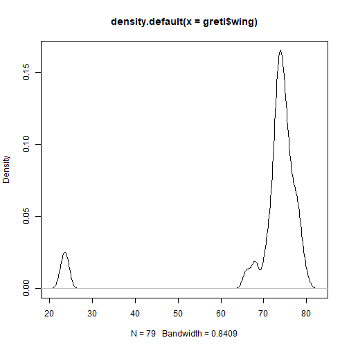

--- .class #id &twocol

`Q-q plots` plot the quantiles (fraction of points below a given value) of the first vector against the quantiles of the second vector 

*** =left

```r
qqnorm(greti$weight);qqline(greti$weight, col = 2)
```


*** =right

```r
qqnorm(greti$wing);qqline(greti$wing, col = 2)
```


--- .class #id

## Formally testing for normality

Eyeballing the data can leave much to interpretation, and there's no guarantee that others will agree with your definition of 'normal'. To quantify the state of our data, we want to calculate the probability ('p-value') that our data are from a normal distribution.

The lower the p-value, the greater the chance that your data deviate from normality. We use a value of 0.05 as a threshold - when the p-value is lower than 0.05, we can have confidence in stating that the data deviate from normality.

There are a number of formal tests available in R, e.g. te `nortest` package. We'll just stick with Shapiro-Wilk, available in base R via `shapiro.test()`. 

--- .class #id

## Shapiro-Wilk test


```r
shapiro.test(greti$weight)
```

```
## 
## 	Shapiro-Wilk normality test
## 
## data:  greti$weight
## W = 0.98897, p-value = 0.736
```

```r
shapiro.test(greti$wing)
```

```
## 
## 	Shapiro-Wilk normality test
## 
## data:  greti$wing
## W = 0.45546, p-value = 1.33e-15
```

--- .class #id

Clearly, something is skewing the wing length data. But what is it?


```r
greti$wing
```

```
##  [1] 23 24 24 24 23 73 73 75 75 76 77 71 68 74 75 75 72 78 73 73 78 74 74
## [24] 77 78 68 68 66 66 73 77 78 72 78 73 80 77 71 76 72 74 75 75 73 77 74
## [47] 74 74 74 74 73 72 74 73 74 76 76 76 71 70 71 74 73 79 75 73 73 74 79
## [70] 74 74 75 78 75 76 76 75 75 73
```

```r
greti[greti$wing <= 24, ]
```

```
##      code      sp_c        sp_l type age sex wing weight
## 170 GRETI Great tit Parus major    N   1       23   17.0
## 171 GRETI Great tit Parus major    N   1       24   17.2
## 172 GRETI Great tit Parus major    N   1       24   16.4
## 173 GRETI Great tit Parus major    N   1       24   18.1
## 174 GRETI Great tit Parus major    N   1       23   16.7
```

--- .class #id

We need to remove these data so that all remaining birds are fledged juveniles and adults.


```r
greti <- greti[!greti$wing <= 24,]
min(greti$wing)
```

```
## [1] 66
```

```r
shapiro.test(greti$wing)
```

```
## 
## 	Shapiro-Wilk normality test
## 
## data:  greti$wing
## W = 0.94789, p-value = 0.004131
```

--- .class #id

## Exercise

Import `pDat.csv` file provided prior to this class

Determine, via plots and statistical tests, whether `b` and `w` are normally distributed

--- .class #id

## Transformations

Trasformations change the shape of a distribution or relationship by replacing a variable by a function of that variable. It is used to coerce variables to similar distributions and address data which violate model assumptions.

Why might we want to transform our data?
- Convenience
- Reducing skewness
- Equal spread
- Modelling relationships (two or more variables)

Most parametric tests require that residuals be normally distributed and that the residuals be homoscedastic (even variance). 

You must be careful about how you report results from analyses with transformed variables! 

--- .class #id &twocol

## Standardisation

Standardised values have a mean of 0 and a standard deviation of 1. Standardised variables are useful for comparing variables of different units.

*** =left 

```r
p <- runif(1000, min=2, max=10)
r <- runif(1000, min=50, max=100)
pr <- data.frame(p,r)
head(pr)
```

```
##          p        r
## 1 2.629066 88.12717
## 2 3.445418 65.42077
## 3 4.096653 78.53689
## 4 3.144890 51.17073
## 5 8.247635 73.53833
## 6 3.281782 55.68346
```

*** =right 

```r
p2 <- as.data.frame(scale(pr))
head(p2)
```

```
##            p           r
## 1 -1.5002542  0.92990509
## 2 -1.1460075 -0.65831528
## 3 -0.8634118  0.25910389
## 4 -1.2764183 -1.65504781
## 5  0.9378591 -0.09052476
## 6 -1.2170155 -1.33940090
```
  

--- .class #id &twocol

Standardisation doesn't affect the shape of the distribution but it changes the relationship

*** =left 

```r
hist(pr$r, prob = TRUE)
lines(density(pr$r, adjust=2), col="blue", lwd=2) 
```

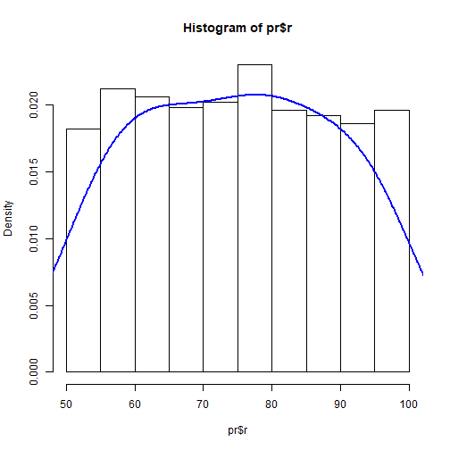

*** =right 

```r
hist(p2$r, prob = TRUE)
lines(density(p2$r, adjust=2), col="blue", lwd=2)
```


  

--- .class #id &twocol

## Equal spread (homoscedasticity)

Homoscedasticity of residuals is an important assumption of linear regression. The variance of residuals should not increase relative to the response variable. Transformation of heteroscedastic data so that residuals are evenly spread eases data handling and interpretation. 

*** =left
<div style='text-align: left;'>
    </img>
</div> 

*** =right
<div style='text-align: left;'>
    </img>
</div> 
  


--- .class #id &twocol

*** =left

```r
lmMod <- lm(dist ~ speed, data=cars)
par(mfrow=c(2,2)) # init 4 charts in 1 panel
plot(lmMod)
```


*** =right
Top-left 
- Residuals vs fitted

Bottom-left
- Standardised residuals

Are points randomly and evenly distributed?
  
Statistical tests
- Breush Pagan 
- NCV
 

--- .class #id

## Skew

If data are skewed, they are asymmetric relative to the normal distribution. The mean is typically less than the median and the tail of the distribution is longer on one side than the other.

Use of skewed data can lead to incorrect results if the data are used inappropriately in statistical tests.

If we want to use 2-sample t-tests to compare two samples of data, both should come from normal distributions and have similar variances.

--- .class #id

Positive skew


```r
y <- rbeta(5000,2,5)
hist(y, prob = TRUE)
lines(density(y, adjust=2), col="blue", lwd=2) 
```


--- .class #id

Negative skew


```r
x <- rbeta(10000,5,2)
hist(x, prob = TRUE)
lines(density(x, adjust=2), col="blue", lwd=2) 
```


--- .class #id

## Reducing skewness

- square (x^2)
- logarithm (log, log10, ln)
- exponential
- square root
- cube root

Which transformation to use?
- What works with the data?
- What makes contextual sense?
- What keeps dimensions simple and convenient?

Positive skew = square root, cube root & log
Negative skew = exponential, square root (constant - x), cube root (constant - x), log (constant - x)
  

--- .class #id &twocol

*** =left
Positive (right) skew


```r
hist(y, prob = TRUE)
lines(density(y, adjust=2), col="blue", lwd=2) 
```


*** =right
  
  

--- .class #id &twocol

*** =left
Positive skew

```r
hist(y, prob = TRUE)
lines(density(y, adjust=2), col="blue", lwd=2) 
```


*** =right
Square root

```r
hist(sqrt(y), prob = TRUE)
lines(density(sqrt(y), adjust=2), col="blue", lwd=2) 
```


  

--- .class #id &twocol

*** =left
Negative (left) skew


```r
hist(x, prob = TRUE)
lines(density(x, adjust=2), col="blue", lwd=2) 
```


*** =right
  

--- .class #id &twocol

*** =left
Negative skew

```r
hist(x, prob = TRUE)
lines(density(x, adjust=2), col="blue", lwd=2) 
```


*** =right
Exponential

```r
hist(exp(x), prob = TRUE)
lines(density(exp(x), adjust=2), col="blue", lwd=2) 
```


 

--- .class #id &twocol

## Back to the bird data

*** =left

```r
plot(density(greti$wing))
```


*** =right

 

--- .class #id &twocol

## Back to the bird data

*** =left

```r
plot(density(greti$wing))
```


*** =right

```r
plot(density(log(greti$wing)))
```


 

--- .class #id &twocol

*** =left

```r
plot(density(exp(greti$wing)))
```


*** =right

```r
plot(density(sqrt(greti$wing)))
```

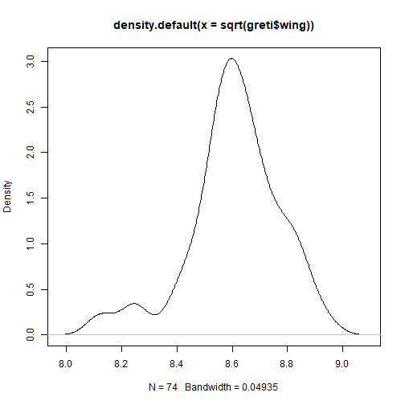

--- .class #id 

## Outliers

Outliers are data points which are located an abnomal distance from other values in a dataset. A dataset may have one or more outliers. The definition of 'abnormal' can be subjective, so you should take care to explain your definition.

One commonly-used definition is that of a data point which falls 1.5x the interquartil range above the third quartile or below the first quartile. 

Outliers are often problematic for data analyses as they can distort model estimates and predictions.


--- .class #id &twocol

## Identifying and removing outliers


```r
names(greti)[1] <- "code"
greti_outliers <- data.frame(code = rep("GRETI", 10),
                      sp_c = rep("Great tit", 10), sp_l = rep("Parus major", 10),
                      type = rep("N", 10), age = rep("3", 10), sex = rep("F", 10),
                      wing = sample(15:23, 10, replace=TRUE), weight = sample(4:8, 10, replace=TRUE))
greti2 <- rbind(greti, greti_outliers) 
```
 

--- .class #id &twocol
With and without outliers

*** =left

```r
plot(greti2$wing, greti2$weight, main="With Outliers", 
     xlab="wing length (cm)", ylab="weight (g)", pch="*", 
     col="red", cex=2)
```

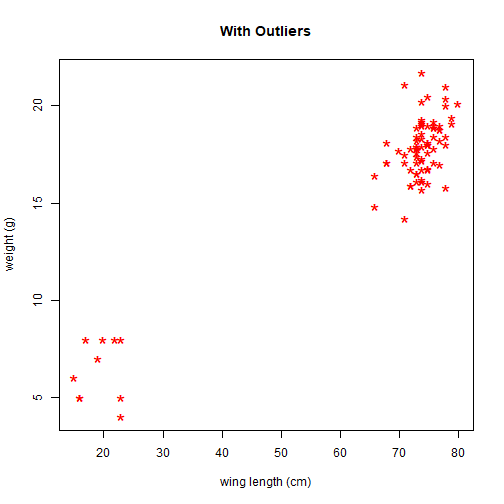

*** =right

```r
plot(greti$wing, greti$weight, main="Without Outliers", 
     xlab="wing length (cm)", ylab="weight (g)", pch="*", 
     col="red", cex=2)
```


 

--- .class #id &twocol

*** =left

```r
qqnorm(greti2$weight);qqline(greti$weight, col = 2)
```

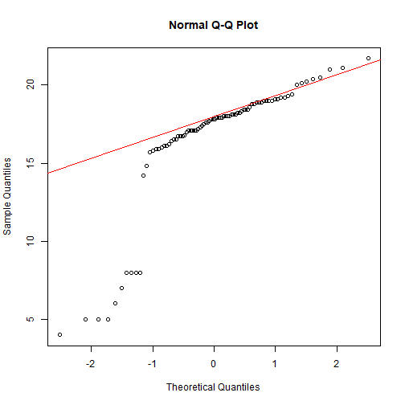

*** =right

```r
qqnorm(greti2$wing);qqline(greti$wing, col = 2)
```


 

--- .class #id &twocol

*** =left
To identify the outliers, compute the I and IV quartiles using the `quartile` function. The compute the range using `IQR`

```r
quantiles <- quantile(greti2$wing, probs = c(.25, .75))
quantiles
```

```
##   25%   75% 
## 72.00 75.25
```

```r
range <- 1.5 * IQR(greti2$wing)
range
```

```
## [1] 4.875
```

*** =right
We can then subset the data, excluding the outliers

```r
greti_normal <- subset(greti2, 
                       greti2$wing > (quantiles[1] - range) 
                     & greti2$wing < (quantiles[2] + range))
min(greti_normal$wing)
```

```
## [1] 68
```
 

--- .class #id &twocol

*** =left

```r
plot(greti_normal$wing, greti_normal$weight, main="Without Outliers", 
     xlab="wing length (cm)", ylab="weight (g)", pch="*", 
     col="red", cex=2)
```

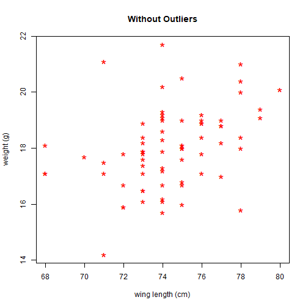

*** =right

```r
qqnorm(greti_normal$wing);qqline(greti_normal$wing, col = 2)
```


 

--- .class #id

## Exercise

Determine whether any of the vectors in the `pDat` dataset exhibit skewness.
- Use plots and statistical tests
- If so, transform the data so that they fit a normal distribution

Determine whether any of the vectors in the `yDat` dataset have any outliers.
- Use scatterplots plots and qq plots
- Use quartiles
- Identify any outliers and remove
- Plot data without outliers

--- .segue bg:white

## Plotting data

--- .class #id &twocol

**Bar plots** represent data in bars where height is reflective of the value. 

*** =left

```r
r <- c(2,2,2,2,3,3,3,4,5,5,5,5,6,6,6,6,6,6,6,6,6)
r_count <- table(r)
barplot(r_count)
```

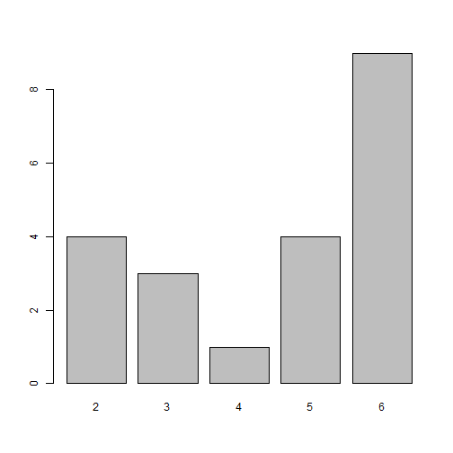

*** =right

```r
s <- c(3, 2, 25, 37, 22, 34, 19)
barplot(s)
```

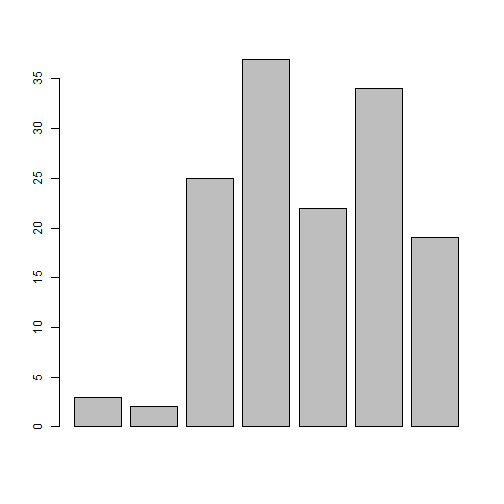
 

--- .class #id &twocol

**Scatter plots** are probably the most commonly used plot type in the biological sciences. Points represent the spatial locations of data from X and Y coordinates. 

*** =left

```r
x <- rnorm(50)
y <- x * 2 + rnorm(50, 0, 0.5)
plot(x, y)
abline(a = 0, b = 2)
```

A scatterplot uses the generic function plot. We can add a line with the function abline, which uses an intercept (here 0) and a slope (here 2)

*** =right

 

--- .class #id

We can also plot a line based on a linear regression

```r
plot(x, y, main = "Plot of X by Y", xlab = "X variable", ylab = "Y variable", xlim = c(-2,2), ylim = c(-4, 2))
lm1 <- lm(y ~ x)
abline(lm1, lty = 2, lwd = 2, col = "blue")
```


--- .class #id &twocol

**Boxplots** display the minimum, first quartile, median, third quartile, and maximum.

*** =left

```r
boxplot(tDat$wing)
```


*** =right

```r
boxplot(tDat$wing ~ tDat$code)
```

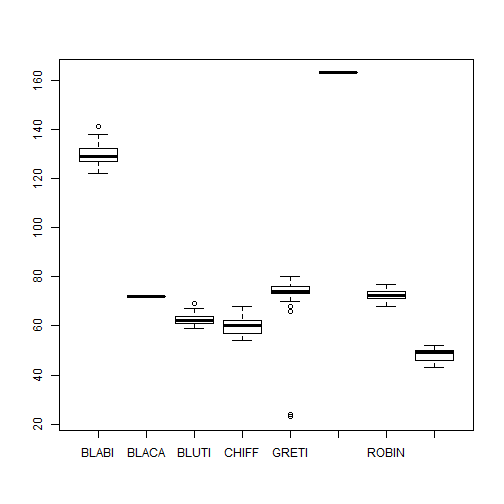
 

--- .class #id &twocol

**Histograms** represent the probability distribution of continuous numerical data. 
*** =left

```r
rand <- rnorm(1000)
hist(rand)
```


*** =right

```r
hist(rand, main = "Normal distribution (frequency)", 
     br = -50:50/10)
```


 

--- .class #id


```r
hist(rand, main = "Normal distribution (frequency)", br = -50:50/10, freq = FALSE)
lines(-50:50/10, dnorm(-50:50/10), lwd = 3, col = "red", lty = 2)
```


--- .class #id
## Conditioning plots (coplots)


```r
tDat2 <- subset(tDat, tDat$code %in% c("BLUTI", "CHIFF", "WREN"))
coplot(tDat2$wing ~ tDat2$weight | tDat2$code, columns=3)
```

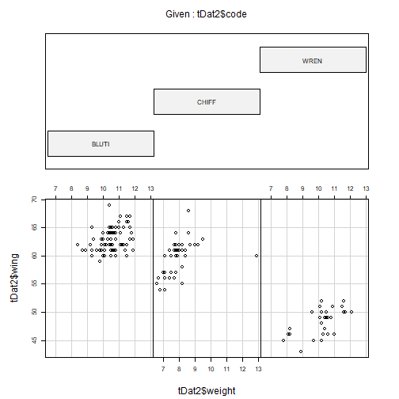

--- .class #id &twocol
*** =left

```r
tDat2 <- subset(tDat, tDat$code %in% c("BLUTI", 
                                       "CHIFF", "WREN"))

coplot(tDat2$wing ~ tDat2$weight | tDat2$code, 
       cex=1.5, number=3, columns=3,
       panel=function(x,y,...) {
          panel.smooth(x,y,span=.8,iter=5,...)
          abline(lm(y ~ x), col="blue")
     } )
```

*** =right

 

--- .class #id &twocol

## Plot aesthetics

Different coloured points for each group (species)

*** =left

```r
library(car)
unique(tDat$code)
tDat$sp_n <- recode(tDat$code, "'BLABI'=1; 'BLUTI'=2; 
                    'CHIFF'=3; 'GRETI'=4;'GREWO'=5;
                    'ROBIN'=6; 'WREN'=7; 'BLACA'=8", 
                    as.numeric.result=TRUE, 
                    as.factor.result = FALSE)
plot(tDat$wing, tDat$weight, col = tDat$sp_n, pch="*")
```

*** =right
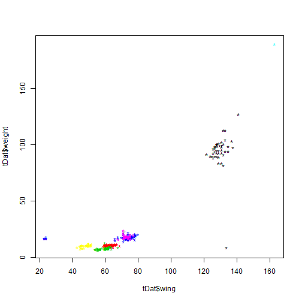
 

--- .class #id &twocol
We can also plot subsets

*** =left

```r
plot(tDat$wing[tDat$sp_n==c(2,3,4,6,7,8)],
     tDat$weight[tDat$sp_n== c(2,3,4,6,7,8)],
     col = tDat$sp_n[tDat$sp_n==c(2,3,4,6,7,8)], 
     pch="*")
```

*** =right

 

--- .class #id &twocol

## ggplot

*** =left
First, we need to load the ggplot package

```r
library(ggplot2)
```

The following command initiates the creation of the plot with default aesthetics.

```r
p <- ggplot(tDat, aes(code))
```

We then add the command to draw the barplot

```r
p + geom_bar()
```

*** =right
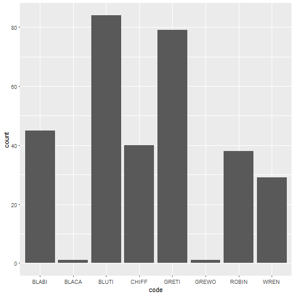
 

--- .class #id &twocol
We can easily manipulate the plot by using aesthetic commands

*** =left

```r
library(ggplot2)
p <- ggplot(tDat, aes(sex, age)) # X by Y
p + geom_bar(stat="identity") + # bar height
  theme_classic() + # Standard theme
  labs(title = "Age and sex of ringed birds", 
         x = "Age (BTO code)",
         y = "Sex",
         caption = "(based on data from the BTO)")
```

*** =right

 

--- .class #id &twocol

*** =left

```r
sx <- subset(tDat, tDat$sex %in% c("M", "F"))

p <- ggplot(sx, aes(sp_c)) # X by Y
p + geom_bar(aes(fill = sex)) + 
  coord_flip() +
  theme(legend.position = "top",
        text = element_text(size=20),
        axis.text.x = element_text(angle=90, hjust=1)) +
  labs(title = "Age and sex of ringed birds", 
         x = "Age (BTO code)",
         y = "Sex")
```

*** =right

 

---.class #id &twocol

*** =left

```r
p <- ggplot(tDat2, aes(wing, weight, colour = code)) + 
  geom_point()
p + labs(colour = "Species code") +
  labs(x = "Wing length (cm)",
       y = "Weight (g)") +
  theme_light()
```

*** =right
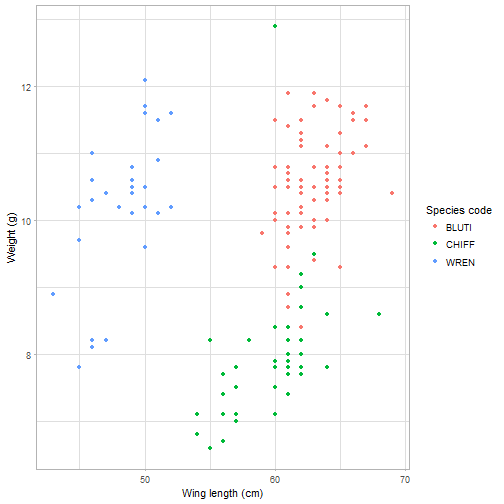


--- .class #id &twocol

*** =left
Boxplots

```r
ggplot(tDat, aes(code, wing)) +
  geom_boxplot()
```

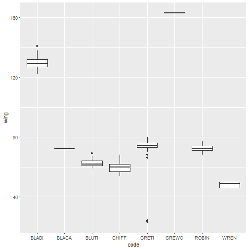

*** =right
Histograms

```r
ggplot(subset(tDat,code %in% c("ROBIN")), aes(weight)) + 
  geom_histogram(binwidth = 0.5)
```

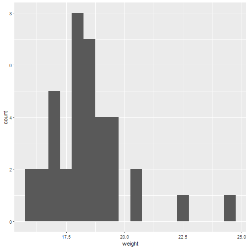
 

--- .class #id

<div style='text-align: center;'>
    </img>
</div> 

--- .class #id


```r
library(ggplot2)
library(magick)
library(here)
p <- ggplot(tDat2, aes(wing, weight, colour = code)) + 
  geom_point() +
  labs(colour = "Species code") +
  labs(x = "Wing length (cm)",
       y = "Weight (g)") +
  theme_light() +
  ggtitle("Birds") +
  ggsave(filename = paste0(here("/"), last_plot()$labels$title, ".png"),
         width = 5, height = 4, dpi = 300)

background <- image_read(paste0(here("/"), "Birds.png"))
logo_raw <- image_read("assets/img/alpaca.gif") 

frames <- lapply(logo_raw, function(frame) {
  image_composite(background, frame, offset = "+70+800")
})

animation <- image_animate(image_join(frames))

image_write(animation, "assets/img/alpaca_plot.gif")
```

--- .class #id

<div style='text-align: center;'>
    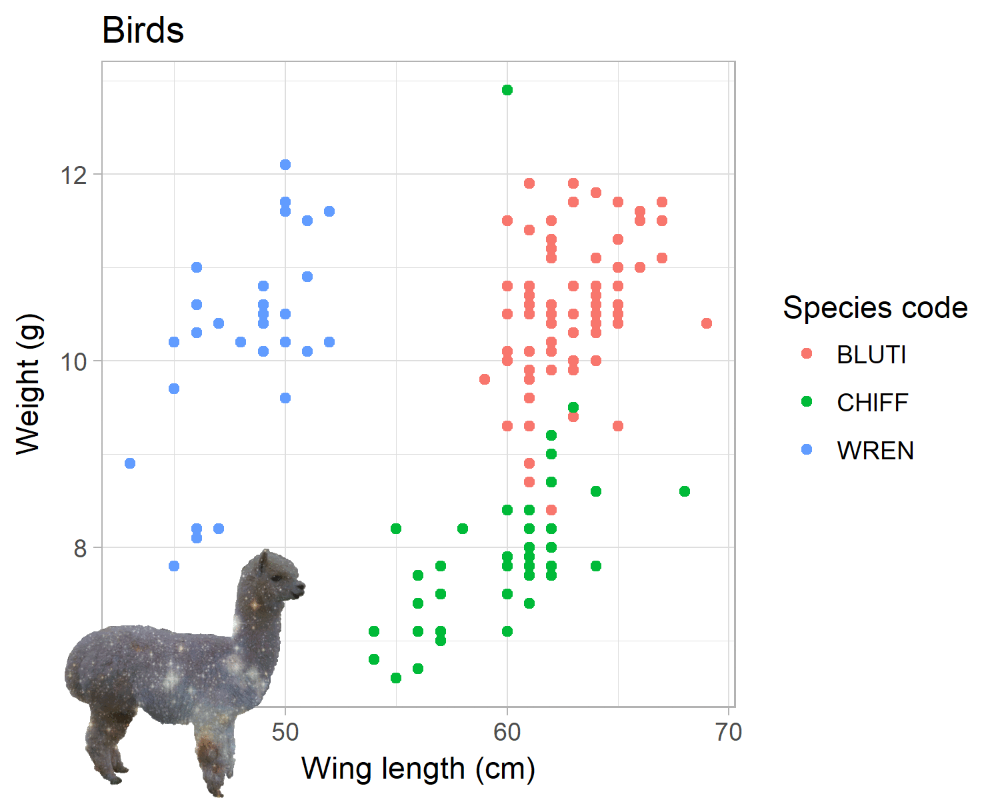</img>
</div> 

--- .class #id &twocol

*** =left
<div style='text-align: center;'>
    </img>
</div>

*** =right

```r
cva <-matrix(c(21, 28, 35, 29),ncol=2,byrow=TRUE)
rownames(cva)<-c("yes","no")
colnames(cva)<-c("cat","cosmic_alpaca")
cva <- as.table(cva)
cva
```

```
##     cat cosmic_alpaca
## yes  21            28
## no   35            29
```

```r
chisq.test(cva, correct=FALSE)
```

```
## 
## 	Pearson's Chi-squared test
## 
## data:  cva
## X-squared = 1.5538, df = 1, p-value = 0.2126
```
 

--- .class #id &twocol

*** =left

```r
tw <- c(21,35)
ch <- c("cat", "cosmic alpaca")
barplot(tw, names = ch)
```

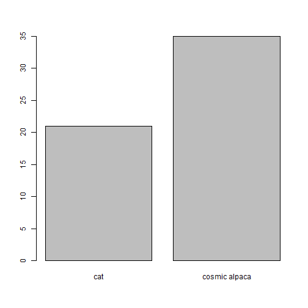

*** =right


--- .class #id &twocol

*** =left

```r
tw <- c(21,35)
ch <- c("cat", "cosmic alpaca")
barplot(tw, names = ch)
```


*** =right
<div style='text-align: center;'>
    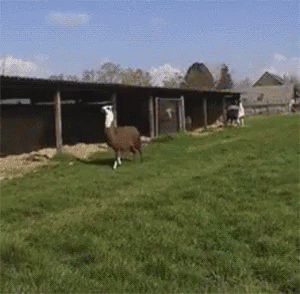</img>
</div>
 

--- .class #id

## In-class CA

Use the `mDat` csv provided prior to the class to answer these questions:

- Extract the 5th - 9th columns for the following genera and derive the mean, median and standard deviation for each column in the resultant dataframe: *Antilocapra*, *Budorcas*, *Connochaetes*, *Panthera*, *Macaca*, *Ursus*
- What is the mean `gestation` length for each Order?
- Test the following taxa for normality and outliers: Cercopithecidae (columns = `gestation`, `b_weight`);  Bovidae (`longevity_yr`, `a_weight`)
- Produce a histogram with density curve based on the Carnivora
- Produce a scatterplot with a line of fit of `a_weight` by `longevity_yr` for the Mustelidae and Viverridae, combined
- Produce one plot using ggplot, including manipulating labels and aesthetics

#### Data from AnAge: The Animal Ageing & Longevity Database (http://lib.stat.cmu.edu/datasets/sleep)


