## Topics covered today

- Choosing the right kind of statistical analysis
- Theory of linear regression

---  .class #id 


## Choosing the right kind of statistical analysis

- One of hardest parts of statistical modelling is getting started, i.e. choosing the right kind of statistical analysis

- Choice depends on nature of your data and the particular question(s) you are trying to answer

- Essential to answer the following:

1. Which of your variables is your response variable?
2. Which are the explanatory variables?
3. Are the explanatory variables continuous, or categorical, or a mixture of both?
4. What kind of response variable do you have: continuous, count, proportion, a time at death, or a category?  
 

---  .class #id 

## Type of test depends on nature of explanatory and response variables
<div style='text-align: center;'>
    </img>
</div>

--- .class #id

## Theory of linear regression

- Regression analysis is the statistical method you use when both the response variable and the explanatory variable are **continuous** (i.e. real numbers with decimal places - things like heights, weights, volumes, or temperatures).
```{r echo=FALSE, fig1, fig.height = 5.5, fig.width = 5.5, fig.align='center'}
plot(cars, xlab="Speed (m/s)" , ylab = "Distance (m)", cex.lab=1.4, cex.axis=1.2, cex=1.2)

```

--- .class #id

## Theory of linear regression

Linear regression comes in different flavours:
- **`linear regression`** (the simplest, and much the most frequently used); 
- **`polynomial regression`** (often used to test for non-linearity in a relationship); 
- `piecewise regression` (two or more adjacent straight lines); 
- `robust regression` (models that are less sensitive to outliers); 
- **`multiple regression`** (where there are numerous explanatory variables); 
- `non-linear regression` (to fit a specified non-linear model to data); 
- `non-parametric regression` (used when there is no obvious functional form).

--- .class #id

## Theory of linear regression

The essence of regression analysis is using sample data to estimate parameter values and their standard errors. 

--- .class #id


## Theory of linear regression

The essence of regression analysis is using sample data to estimate parameter values and their standard errors. 

First, however, we need to select a model which describes the relationship between the response variable and the explanatory variable(s). 

The simplest of all is the linear model:

  $$y = a + bx$$

There are 2 **variables** (*$y$* and *$x$*) and 2 **paramaters** (*$a$* and *$b$*)

The intercept is **$a$** (the value of $y$ when $x$=0)

The slope is **$b$**  (the change in $y$ divided by the change in $x$ which brought it about)

--- .class #id

## Theory of linear regression

Let's start with an example which shows the growth of caterpillars fed on experimental diets differing in their tannin content (see Chapter 10 of Crawley 2007 *The R Book*):

```{r}
reg.data<-read.table("datasets\\regression.txt",header=T) 
str(reg.data)
names(reg.data)

```

---  .class #id &twocol

## Theory of linear regression

*** =left

```{r echo=F}
par(oma=c(0,0,0,0))
```

```{r fig2, fig.height = 5.5, fig.width = 5.5, fig.align='center'}
with(reg.data, 
     plot(tannin,growth,pch=1, 
          cex.lab=2, cex.axis=1.5, cex=1.5))

```
*** =right
<br>

The higher the percentage of tannin in the diet, the more slowly the caterpillars grew. 

One can get a crude estimate of the parameter values by eye.

**Slope** looks like around -10/8=  -1.25 

**Intercept** looks like around 12. 

So: $$y \approx 12.0 -1.25x$$


--- .class #id

## Theory of linear regression

But what we want is an *objective method* of computing parameter estimates from the data that are in some sense the 'best' estimates of the parameters for these data and this particular model. 

- Convention in modern statistics is to use the **maximum likelihood (ML) estimates** of the parameters as providing the 'best' estimates. That is:

<br>
**Given the data, and having selected a linear model, we want to find the values of the slope and intercept that make the data most likely**

<br>
The **method of least squares** gives the ML estimates, under the following set of assumptions:

---  .class #id &twocol

## Theory of linear regression

*** =left

<br>

- The variance in $y$ is constant (i.e. the spread does not change as $y$ gets bigger). 
- The explanatory variable, $x$, is measured without error. 
- The difference between a measured value of $y$ and the value predicted by the model for the same value of $x$ is called a residual. 
- Residuals are measured on the scale of $y$ (i.e. parallel to the $y$ axis). 
- The residuals are normally distributed.

*** =right

```{r echo=F, fig3, fig.height = 6, fig.width = 6, fig.align='right'}
with(reg.data, 
     plot(tannin,growth,pch=1, 
          cex.lab=1.5, cex.axis=1.3, cex=1.3))

mod<- lm(growth~tannin, data=reg.data)
abline(mod)
for (i in 1:length(reg.data$tannin)) { 
lines(x=c(reg.data$tannin[i],reg.data$tannin[i]),y=c(reg.data$growth[i], predict(mod)[i]),col='grey')
}

```
$$d = y -\hat{y}$$
$$d = y -(a+bx) = y - a - bx$$

--- .class #id

## The famous sum of squares

The sum of the squares of these distances (i.e. residuals) provides a measure of lack of fit
$$\sum{d^{2}} = \sum{({y-\hat {y}})^2}$$

<br>

$$     = \sum{(y-a-bx)^2}$$


---  .class #id &twocol

## The famous sum of squares

*** =left
The best fit line is defined as passing through the point defined by the mean value of $x$ and the mean value of $y$, i.e. $(\bar x, \bar y)$.

```{r echo=F}
par(oma=c(0,0,0,0), mar=c(4,4,0,0))
```


```{r echo=F, fig4, fig.height = 5.5, fig.width = 5.5, fig.align='left'}
with(reg.data, 
     plot(tannin,growth,pch=1, 
          cex.lab=1.5, cex.axis=1.3, cex=1.3, ylim=c(0,14)))

mod<- lm(growth~tannin, data=reg.data)
abline(mod)
for (i in 1:length(reg.data$tannin)) { 
lines(x=c(reg.data$tannin[i],reg.data$tannin[i]),y=c(reg.data$growth[i], predict(mod)[i]),col='grey')
}
with(reg.data, points(mean(tannin), mean(growth), cex=3, lwd=2))

```

*** =right

- Imagine pivoting the line around this mean: what would happen to the sum of squares?


---  .class #id &twocol

## The famous sum of squares

*** =left
The best fit line is defined as passing through the point defined by the mean value of $x$ and the mean value of $y$, i.e. $(\bar x, \bar y)$.

```{r echo=F}
par(oma=c(0,0,0,0), mar=c(4,4,0,0))
```


```{r echo=F, fig5, fig.height = 5.5, fig.width = 5.5, fig.align='left'}
with(reg.data, 
     plot(tannin,growth,pch=1, 
          cex.lab=1.5, cex.axis=1.3, cex=1.3, ylim=c(0,14)))
reg.data$tannin_c <- reg.data$tannin - mean(reg.data$tannin)
a<- coef(mod)[1]-1.55
b<- coef(mod)[2]+0.4
abline(a=a, b=b)
for (i in 1:length(reg.data$tannin)) { 
lines(x=c(reg.data$tannin[i],reg.data$tannin[i]),y=c(reg.data$growth[i],(a+b*reg.data$tannin[i])),
      col='grey')
}
with(reg.data, points(mean(tannin), mean(growth), cex=3, lwd=2))

```

*** =right

- Imagine pivoting the line around this mean: what would happen to the sum of squares?


---  .class #id &twocol

## The famous sum of squares

*** =left
The best fit line is defined as passing through the point defined by the mean value of $x$ and the mean value of $y$, i.e. $(\bar x, \bar y)$.

```{r echo=F}
par(oma=c(0,0,0,0), mar=c(4,4,0,0))
```


```{r echo=F, fig6, fig.height = 5.5, fig.width = 5.5, fig.align='left'}
with(reg.data, 
     plot(tannin,growth,pch=1, 
          cex.lab=1.5, cex.axis=1.3, cex=1.3, ylim=c(0,14)))

mod<- lm(growth~tannin, data=reg.data)
abline(mod)
for (i in 1:length(reg.data$tannin)) { 
lines(x=c(reg.data$tannin[i],reg.data$tannin[i]),y=c(reg.data$growth[i], predict(mod)[i]),col='grey')
}
with(reg.data, points(mean(tannin), mean(growth), cex=3, lwd=2))

```

*** =right

- Imagine pivoting the line around this mean: what would happen to the sum of squares?


---  .class #id &twocol


## The famous sum of squares

*** =left
The best fit line is defined as passing through the point defined by the mean value of $x$ and the mean value of $y$, i.e. $(\bar x, \bar y)$.

```{r echo=F}
par(oma=c(0,0,0,0), mar=c(4,4,0,0))
```


```{r echo=F, fig7, fig.height = 5.5, fig.width = 5.5, fig.align='left'}
with(reg.data, 
     plot(tannin,growth,pch=1, 
          cex.lab=1.5, cex.axis=1.3, cex=1.3, ylim=c(0,14)))
reg.data$tannin_c <- reg.data$tannin - mean(reg.data$tannin)
a<- coef(mod)[1]+1.55
b<- coef(mod)[2]-0.4
abline(a=a, b=b)
for (i in 1:length(reg.data$tannin)) { 
lines(x=c(reg.data$tannin[i],reg.data$tannin[i]),y=c(reg.data$growth[i],(a+b*reg.data$tannin[i])),
      col='grey')
}
with(reg.data, points(mean(tannin), mean(growth), cex=3, lwd=2))

```

*** =right

- Imagine pivoting the line around this mean: what would happen to the sum of squares?


---  .class #id &twocol


## The famous sum of squares

*** =left
The best fit line is defined as passing through the point defined by the mean value of $x$ and the mean value of $y$, i.e. $(\bar x, \bar y)$.

```{r echo=F}
par(oma=c(0,0,0,0), mar=c(4,4,0,0))
```


```{r echo=F, fig8, fig.height = 5.5, fig.width = 5.5, fig.align='left'}
with(reg.data, 
     plot(tannin,growth,pch=1, 
          cex.lab=1.5, cex.axis=1.3, cex=1.3, ylim=c(0,14)))
reg.data$tannin_c <- reg.data$tannin - mean(reg.data$tannin)
a<- coef(mod)[1]+1.55
b<- coef(mod)[2]-0.4
abline(a=a, b=b)
for (i in 1:length(reg.data$tannin)) { 
lines(x=c(reg.data$tannin[i],reg.data$tannin[i]),y=c(reg.data$growth[i],(a+b*reg.data$tannin[i])),
      col='grey')
}
with(reg.data, points(mean(tannin), mean(growth), cex=3, lwd=2))

```

*** =right

- Imagine pivoting the line around this mean: what would happen to the sum of squares?

<div style='text-align: center;'>
    </img>
</div>

- The ML estimate of the slope is the value of b associated with the **minimum
value** of the sum of the squares of the residuals

---  .class #id &twocol

## The famous sum of squares

*** =left
With these three quantities...

<div style='text-align: center;'>
    </img>
</div>

<br>
... we can easily calculate the ML esimate of the parameters and their standard errors.

*** =right

---  .class #id &twocol

## The famous sum of squares

*** =left
With these three quantities...

<div style='text-align: center;'>
    </img>
</div>

<br>
... we can easily calculate the ML esimate of the parameters and their standard errors.
The **ML estimate of the slope** is just:

<div style='text-align: center;'>
    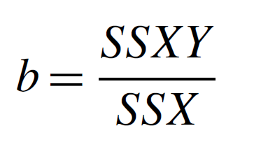</img>
</div>


*** =right

---  .class #id &twocol

## The famous sum of squares

*** =left
With these three quantities...

<div style='text-align: center;'>
    </img>
</div>

<br>
... we can easily calculate the ML esimate of the parameters and their standard errors.
The **ML estimate of the slope** is just:

<div style='text-align: center;'>
    </img>
</div>


*** =right

- One part of the definition of the best-fit straight line is that it passes through the the mean values of $x$ and $y$. Since we know that $y = a + bx$, it must be the case that: 
$$\bar{y} = a + b\bar{x}$$
and so the **ML estimate of the intercept** is simply:
$$ a = \bar{y} - b\bar{x}$$

---  .class #id &twocol


## The famous sum of squares

*** =left
With these three quantities...

<div style='text-align: center;'>
    </img>
</div>

<br>
... we can easily calculate the ML esimate of the parameters and their standard errors.
The **ML estimate of the slope** is just:

<div style='text-align: center;'>
    </img>
</div>


*** =right

- One part of the definition of the best-fit straight line is that it passes through the the mean values of x and y. Since we know that *y = a + bx*, it must be the case that: 
$$\bar{y} = a + b\bar{x}$$
and so the **ML estimate of the intercept** is simply:
$$ a = \bar{y} - b\bar{x}$$
And the standard errors:
<div style='text-align: center;'>
    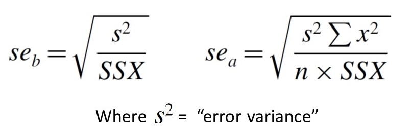</img>
</div>

---  .class #id 

## Linear regression in R

The function for carrying out linear regression in R is lm (which stands for 'linear model').

```{r}
lm(growth ~ tannin, data=reg.data)
```

We can now write the maximum likelihood equation like this:
$$growth = 11.756 - 1.217 \times  tannin$$

---  .class #id 

## Degree of scatter

There is another very important issue that needs to be considered, because two data sets
with exactly the same slope and intercept could look quite different:

<div style='text-align: center;'>
    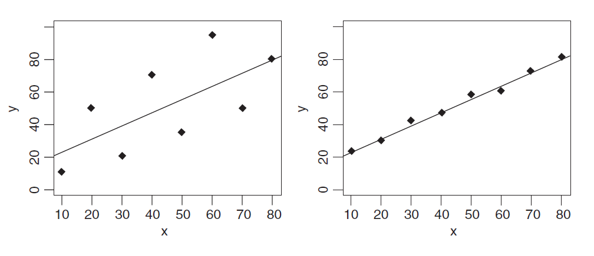</img>
</div>


---  .class #id 

## Degree of scatter

There is another very important issue that needs to be considered, because two data sets
with exactly the same slope and intercept could look quite different:

<div style='text-align: center;'>
    </img>
</div>

We need a way to quantify the degree of scatter, so that the graph on the left has a high
value and the graph on the right has a low value.
We can use our sum of squares of the residuals! Also known as the **error sum of squares, SSE**.


---  .class #id 

## The coefficient of determination

By tradition, however, when talking about the degree of scatter we actually quantify the *lack of scatter*
<br>

Here we use the coefficient of determination, more commonly known simply as 'r squared':  
**r^2** = *the fraction of the total variation in y that is explained by variation in x*

$$ r^{2}=\frac{SSY-SSE}{SSY} $$
<div style='text-align: center;'>
    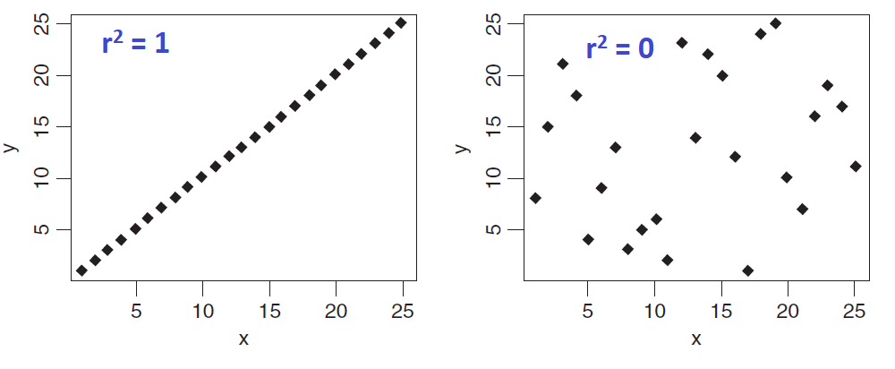</img>
</div>

---  .class #id 

## The coefficient of determination

- In R, a null model can be fitted in which growth is described by an intercept only. 
```{r}
# This gives SSY. Note than in R, the intercept is called parameter 1: 
deviance(lm(growth~1, data=reg.data))
```
- The value of *SSE* can be extracted very simply from the regression model:
```{r}
deviance(lm(growth~tannin, data=reg.data))
```

$$ r^2 = \frac {108.8889 - 20.07222}{108.8889} = 0.8156633 $$

---  .class #id 

## The coefficient of determination

- But of course, the value of *r^2* can be extracted directly from the model:
```{r}
#Note the use of [[8]] to subset the output of a list:
summary(lm(growth~tannin, data=reg.data))[[8]]
```

---  .class #id 

## The coefficient of determination

- But of course, the value of *r^2* can be extracted directly from the model:
```{r}
#Note the use of [[8]] to subset the output of a list:
summary(lm(growth~tannin, data=reg.data))[[8]]
```

- The correlation coefficient, *r*, is given by:
$$ r = \frac {SSXY}{\sqrt {SSX \times SSY}} = \frac {cov(x,y)}{\sqrt {var(x)var(y)}} $$
- Remember, $var(x)=SSX/(n-1)$ and $covar(x,y)=SSXY/(n-1)$ 
- *Why n-1?* Good question! See here: https://tinyurl.com/y8rel9lb

---  .class #id 

## Analysis of variance in regression

- The idea is simple: we take the total variation in $y$, *SSY*, and partition it into components
that tell us about the explanatory power of our model.
- ***SSY*** = ***SSR*** *(REGRESSION SUM OF SQUARES)* + ***SSE*** *(ERROR (RESIDUAL) SUM OF SQUARES)*
```{r}
(sse<-deviance(lm(growth~tannin, data=reg.data)))
(ssy<-deviance(lm(growth~1, data=reg.data)))
(ssr<-ssy-sse)
```

---  .class #id 

## Analysis of variance in regression

- We now have all the sums of squares, but what about the degrees of freedom?
- Remember, degrees of freedom equals the *number of data points minus the number of parameters estimated from the data*, i.e. ***df = n - p***
- To calculate *SSY*, we had to estimate 1 parameter - the overall mean - so the total *df* = n-1
- SSE (error) was calculated after 2 parameters (intercept and slope) had been estimated from the data, so error *df* = n-2
- Finally, the regression model added just one parameter, the slope *b*, compared with the null
model, so there is one regression degree of freedom

<div style='text-align: center;'>
    </img>
</div>

---  .class #id 

## Analysis of variance in regression
```{r}
mod<- lm(growth~tannin, data=reg.data)
anova(mod)
# note the same output can be obtained using summary.aov(mod)
```
- The *F ratio* is sufficiently large that we can reject the null hypothesis


---  .class #id 

## Analysis of variance in regression

To calculate the critical value of *F*, expected by chance alone, we use the quantiles of the *F* distibution, with 1 d.f. in the numerator and 7 d.f. in the denominator. We have to 'put up with' some arbirtary level of uncertainty, which is traditionally set at 5%. Thus we have 95% certainty:

```{r}
qf(p=0.95, df1=1, df2=7)
```

Or we can ask what is the probability of getting a value for *F* as big as 30.974 or larger if the null hypothesis is true?
```{r}
1-pf(q=30.974, df1=1, df2=7)
```

---  .class #id 

## The *summary.lm* table

- Of the two sorts of summary table, *summary.lm* is by far the more informative, because it shows the effect sizes (in this case the slope of the graph) and their unreliability estimates (the standard error of the slope):

```{r, eval=F}
summary(lm(growth~tannin, data=reg.data))
```

<div style='text-align: center;'>
    </img>
</div>


---  .class #id 

## The *summary.lm* table

<div style='text-align: center;'>
    </img>
</div>

- The residual standard error is the square root of the error variance from the ANOVA table
- Multiple R-squared is the fraction of the total variance explained by the model (*SSR/SSY* = 0.8157)
- The Adjusted R-squared is based on variances instead of SS, and is given by: (total variance - error variance) / total variance

---  .class #id 

## Confidence intervals

- There is a built-in function, *confint*, which produces 95% confidence intervals for the estimated parameters from the model directly like this:

```{r}
confint(mod)
```

- These values are obtained by subtracting from, and adding to, each parameter estimate an interval which is the standard error times Student's *t* with 7 degrees of freedom (the appropriate value of *t* is given by *qt*(.975, 7) = 2.364624).
- The fact that neither interval includes 0 indicates that both parameter values are significantly different from zero, as
established by the earlier *F* tests. 


---  .class #id 

## Prediction using the fitted model

- First, we save the results of fitting the model in a named object, which is good practice:

```{r}
# Note here we call it "model", but you could call it Paddy if you wanted!!
model<-lm(growth~tannin, data=reg.data)
```

- The object called *model* can now be used for all sorts of things. We can use the *predict* function to obtain the predicted growth at different tannin concentrations:

```{r}
predict(model,list(tannin=5.5))
predict(model,list(tannin=c(3.3,4.4,5.5,6.6)))
```

---  .class #id 

## Prediction using the fitted model

- Note that the default for this function is to predict the values of the response ($y$) variable at the observed values of the $x$ variable (here = *tannin*):
```{r}
predict(model)
```

- The following code can be used to draw a smooth fitted line through the data (works for more complex models too):
```{r, eval=F}
xv<-seq(from=min(reg.data$tannin, na.rm=T), to=max(reg.data$tannin, na.rm=T), length.out=100)
p<- as.data.frame(predict(model,list(tannin=xv), interval = "confidence"))
with(reg.data, plot(growth ~ tannin))
lines(xv, p$fit); lines(xv, p$lwr, lty=2); lines(xv,p$upr, lty=2)
```


---  .class #id 

## Model checking

- This is an *indepensable* step in the process - you must expose the model to critical appraisal!!
- Key assumptions we really want to be sure about are **constancy of variance** and **normality of
errors**
- Base R has built-in model checking plots for this:
```{r, eval=F}
plot(model)
```

---  .class #id &twocol

## Model checking

*** =left

```{r, echo=F}
par(mfrow=c(2,2))
plot(model)
```

---  .class #id &twocol

## Model checking

*** =left

```{r, echo=F}
par(mfrow=c(2,2))
plot(model)
```

*** =right
- What is the effect of removing the influential data point #7?
```{r, eval=F}
model2<-update(model,
  subset=(reg.data$tannin != reg.data$tannin[7]))
summary(model2)
```

<div style='text-align: center;'>
    </img>
</div>

```{r, eval=F}
summary(model)
```
<div style='text-align: center;'>
    </img>
</div>


---  .class #id

## Heteroscedasticity

<div style='text-align: center;'>
    </img>
</div>


---  .class #id

## Mis-specified model:

- Should also plot the residuals against the explanatory variables, to check for e.g. evidence of curvature:
```{r, eval=F}
par(mfrow=c(1,2))
plot(resid(model) ~ reg.data$tannin)
x <- seq(1,10,length.out=50);  y <- 0.5*x^2+rnorm(length(x),0,2)
plot(resid(lm(y~x)) ~ x)
```
<div style='text-align: center;'>
    </img>
</div>


---  .class #id

## Correctly specified model:

```{r, eval=F}
model2<- lm(y ~ x + I(x^2)) ;  summary(model2)
plot(y ~ x)
plot(resid(model2) ~ x)
```
<div style='text-align: center;'>
    </img>
</div>

<div style='text-align: center;'>
    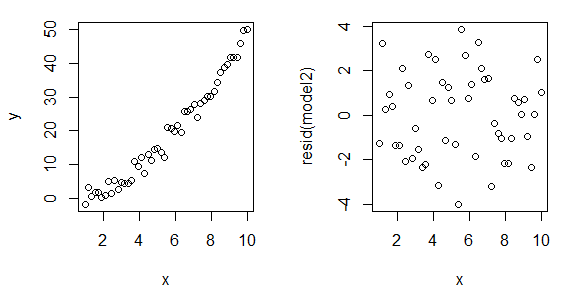</img>
</div>


---  .class #id

## Non-normality of errors

- Here we are going to generate a series of data sets where we introduce different but known kinds of non-normal errors
- We will then plot them using a simple home-made function (Crawley 2007):

```{r}
mcheck <-function (obj, ...) {
rs<-obj$resid
fv<-obj$fitted
par(mfrow=c(1,2))
plot(fv,rs,xlab="Fitted values",ylab="Residuals")
abline(h=0, lty=2)
qqnorm(rs,xlab="Normal scores",ylab="Ordered residuals",main="")
qqline(rs,lty=2)
par(mfrow=c(1,1))
invisible(NULL) }
```

- Idea is to see what patterns are generated in normal plots

---  .class #id

## Example 1: normal errors!!

- Let's first get a sense of how variable these plots can look when the errors are in fact normally distributed
- First we need a vector of $x$ values. Then we manufacture the response variables according to the equation:
$$ y = 10 + x + \varepsilon $$
```{r}
x<-0:30 ; length(x)
```

```{r, eval=F}
e<-rnorm(31,mean=0,sd=5)
yn<-10+x+e
mn<-lm(yn ~ x)
mcheck(mn)
```

---  .class #id

## Example 1: normal errors!!

```{r, echo=F}
e<-rnorm(31,mean=0,sd=5)
yn<-10+x+e
mn<-lm(yn ~ x)
mcheck(mn)
```

---  .class #id

## Now you guys try different types of non-normal errors:

- Try running the *mcheck* function now on data generated using the following types of errors instead:
```{r}
# Uniform errors:
eu<-20*(runif(31)-0.5)
# Negative binomial errors:
enb<-rnbinom(31,2,.3)
# Gamma errors and increasing variance
eg<-rgamma(31,1,1/x)

```


---  .class #id

## Introducing... general linear models

- General linear models are a class of statistical model that includes regression, multiple regression, ANOVA and ANCOVA. 
- Share a common framework for estimation (leaset squares) and a common set of assumptions, centred around the idea of normally distributed residuals
- Not to be confused with the *generalised* linear model, known as the **GLM** (where key assumptions about normality are relaxed)

---  .class #id

## Introducing... general linear models

- General linear models are a class of statistical model that includes regression, multiple regression, ANOVA and ANCOVA. 
- Share a common framework for estimation (leaset squares) and a common set of assumptions, centred around the idea of normally distributed residuals
- Not to be confused with the *generalised* linear model, known as the **GLM** (where key assumptions about normality are relaxed)
- A very sensible workflow (see the excellent Beckerman, Childs & Petchey 2017 book) for general linear models (and indeed all models) is this:

**Plot  ->   Model   ->   Check Assumptions   ->    Interpret   ->    Plot Again** 

- We'll now go through another linear regression example, to hammer this home... but this time using super-handy functions from the *dplyr* and *ggplot2* packages!

---  .class #id

## Worklow for general linear models

- We'll use the plant growth dataset used also by Beckerman, Childs & Petchey (2017). 
- Our basic question is whether plant growth rates vary with soil moisture content?

```{r, eval=F}
#################################################################
# Plant growth linear model example
#################################################################

# First we clear the decks:
rm(list = ls())

# Load the necessary libraries:
library(dplyr)
library(ggplot2)

# import the data:
plant_gr <- read.csv("Datasets/plant.growth.rate.csv")
```

---  .class #id

## Worklow for general linear models

- Use **glimpse()** to inspect the data:
```{r}
glimpse(plant_gr)
```

- All seems to be in order.  Next step then is to make a picture that reflects our question...which in this case simply means plotting *plant.growth.rate* against *soil.moisture.content*


---  .class #id

## Workflow for general LMs: (1) Plot

```{r, eval=F}
ggplot(plant_gr,
       aes(x = soil.moisture.content, y = plant.growth.rate)) + 
        geom_point(size=3) + 
        ylab("Plant Growth Rate (mm/week)") + 
        theme_bw() + 
        theme(axis.title=element_text(size=14))
```
<div style='text-align: center;'>
    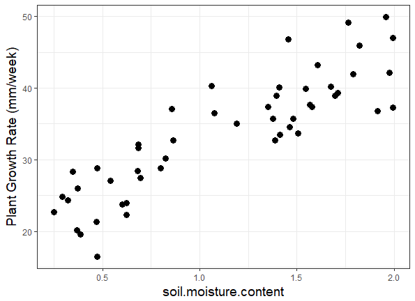</img>
</div>

---  .class #id

## Workflow for general LMs: (2) Model

- Now we fit a simple regression model using *lm()*
```{r}
# Fit LM:
model_pgr <- lm(plant.growth.rate ~ soil.moisture.content, 
                data = plant_gr)
```

---  .class #id

## Workflow for general LMs: (3) Check Assumptions:

- Although temptation is to rush ahead and check the model results, we must first check the assumptions of the linear model.
- ***ggplot2*** needs a little push with this, as it doesn't know what linear models are.
- Help comes from ***ggfortify***, and its **autoplot()** function, which, when given a linear model created by **lm()**, produces four very useful figures (same 4 as produced by **plot()** in base R)
```{r, eval=F}
library(ggfortify)
autoplot(model_pgr, smooth.colour = NA)
```

---  .class #id

## Workflow for general LMs: (3) Check Assumptions:

<div style='text-align: center;'>
    </img>
</div>


---  .class #id

## Workflow for general LMs: (4) Intepret:

- Now we are ready to see whether we can reject the null hypothesis that soil moisture content has no effecft on plant growth rate:
```{r}
anova(model_pgr)
```

---  .class #id

## Workflow for general LMs: (4) Intepret:

```{r}
summary(model_pgr)
```

---  .class #id

## Workflow for general LMs: (4) Intepret:

Recommended way to report this in a paper:

"Soil moisture content had a positive effect on plant growth. For each unit increase in soil moisture, plant growth rate increased by 12.7 mm/week (slope = 12.7, *t* = 12.5, d.f. = 48, *p* < 0.001)."

---  .class #id

## Workflow for general LMs: (5) From stats back to figure:

- Our final step in the workflow involves translating the model we have fitted back onto our figure of the raw data:
```{r, eval=F}
ggplot(plant_gr, aes(x = soil.moisture.content, y = plant.growth.rate)) + 
  geom_point() +
  geom_smooth(method = 'lm') +
  ylab("Plant Growth Rate (mm/week)") +
  theme_bw() + 
  theme(axis.title=element_text(size=14))
```

---  .class #id

## Workflow for general LMs: (5) From stats back to figure:


<div style='text-align: center;'>
    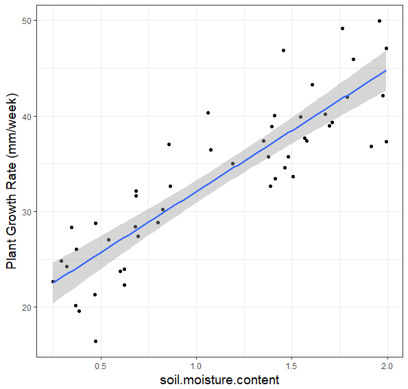</img>
</div>


---  .class #id

## Analysis of variance (ANOVA)

- We use ANOVA when all explanatory variables are categorical
- The explanatory variables are called **factors**, and each factor has two or more ***levels***
- When there is a single factor with 3 or more levels we use **one-way ANOVA**.
- If we had a single factor with just 2 levels, we would use a simple *t* test:
  would give exactly same answer as ANOVA (remember the rule that $F=t^2$)
- When there are 2 or more factors, we use **two-way or three-way  ANOVA**, etc.
- When there is **replication** at each combination of levels in a multi-way ANOVA, the experiment is called a **factorial design**. Allows us to study *interactions* between variables, i.e. does the response to one factor depends on the level of another factor?

---  .class #id

## One-way ANOVA

The paradox of ANOVA: 
The idea of analysis of variance is to compare two or more **means**, but it does this by comparing ***variances***. How can that work?

Best illustrated using an example: 
- An experiment in which crop yields per unit area were measured from 10 randomly selected fields on each of *three soil types*. 
- All fields were sown with the same variety of seed and provided with the same fertilizer and pest control inputs. 
- The question is whether soil type significantly affects crop yield, and if so, to what extent?
  
```{r}
yields<- read.csv("datasets/yields.csv", header=T)
```


---  .class #id

## One-way ANOVA

```{r}
summary(yields)
with(yields, tapply(yield, soil, mean))
```


---  .class #id

## One-way ANOVA

Before carrying out analysis of variance, we should check for constancy of variance across the three soil types:
```{r}
with(yields, tapply(yield, soil, var))
```
The variances differ by more than a factor of 2. But is this significant? We test for heteroscedasticity using the Fligner-Killeen test of homogeneity of variances:
```{r, eval=F}
with(yields,  
     fligner.test(yield~soil))
```

---  .class #id

## One-way ANOVA

```{r, echo=FALSE}
with(yields,  fligner.test(yield~soil))
```

No evidence of any significant difference in variance across the three samples, so it is legitimate to continue
with our one-way ANOVA!

---  .class #id &twocol

## One-way ANOVA

*** =left
```{r, echo=F}
with(yields,  plot(yield~soil, cex.axis=1.4, cex.lab=1.6))
```

*** =right
- The analysis of variance involves calculating the total variation in the response variable (yield in this case) and partitioning it ('analysing it') into informative components. In the simplest case, we partition the total variation into just two components: **explained variation** and **unexplained variation**:

<div style='text-align: center;'>
    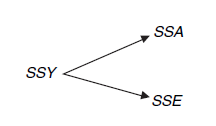</img>
</div>


---  .class #id &twocol

## One-way ANOVA

*** =left
- Explained variation is called the **treatment sum of squares (SSA)** and unexplained variation is called the **error sum of squares** (**SSE**, also known as the residual sum of squares). The unexplained variation is defined as the sum of the squares of the differences between the individual y values and the relevant treatment mean
- $k$ parameters (where $k$ = no. of factor levels) were estimated from the data to work out SSE, so $k$ degrees of freedom are lost in the process
- If each level of the factor has $n$ replicates, there are $kn$ data points in total
- So the d.f. associated with **SSE** are $kn - k = k(n-1)$


*** =right
<div style='text-align: center;'>
    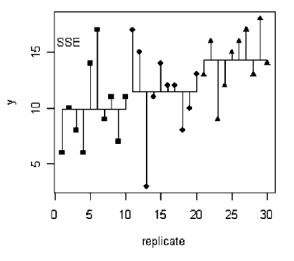</img>
</div>

---  .class #id &twocol

## One-way ANOVA

*** =left
- **SSY**, the total sum of squares, is calculated simply as the sum of the squares of the residuals of the data points from the overall, or grand, mean:

<div style='text-align: center;'>
    </img>
</div>

*** =right
- One parameter (the grand mean) was estimated in calculating **SSY**, so the d.f. for **SSY** are $kn-1$ 

<br>

**SSA** can then be calculated by simple subtraction:  **SSA = SSY - SSE**
- There are 3 soil types, so there are 3-1 d.f. for **SSA**
- Note that d.f. for **SSA** plus the d.f. for **SSE** must sum to the total d.f.
- i.e. $(k-1)+k(n-1)=kn-1$
- in this case: $2+27=29$

---  .class #id 

## One-way ANOVA

- The extent to which the lines are shorter in **SSE** than in **SSY** is a measure of the significance of the difference between the mean yields on the different soils. 
- In the extreme case in which there was no variation between the replicates, then **SSY** is large, but **SSE** is zero:

<div style='text-align: center;'>
    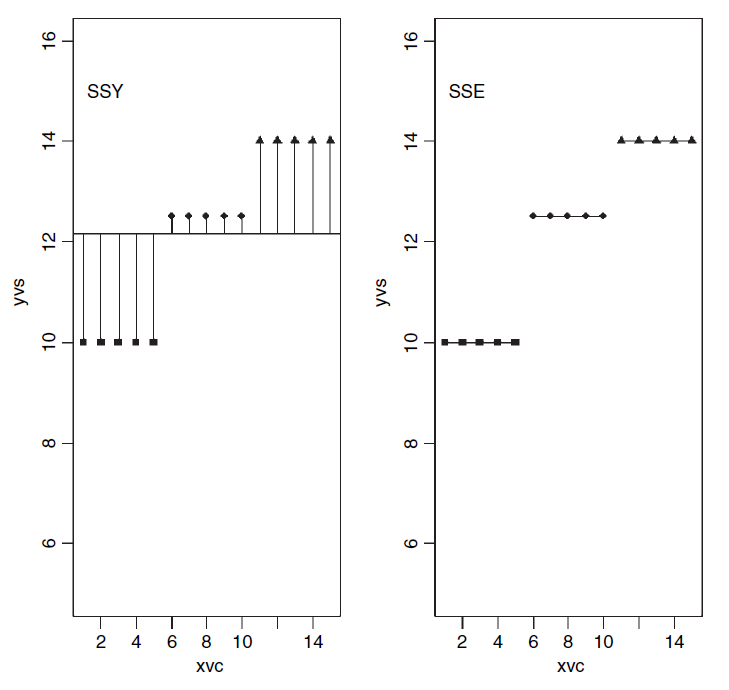</img>
</div>

---  .class #id 

## ANOVA table for one-way ANOVA

<div style='text-align: center;'>
    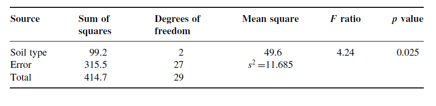</img>
</div>

- The error variance, $s^2$, is the residual mean square, sometimes called the *'pooled error variance'* because it is calculated across all the treatments:

```{r}
with(yields, tapply(yield, soil, var))
mean(with(yields, tapply(yield, soil, var)))
```


---  .class #id 

## ANOVA table for one-way ANOVA

<div style='text-align: center;'>
    </img>
</div>

- The ***F*** **ratio** is the *treatment variance* divided by the *error variance*, testing the null hypothesis that the treatment means are all the same.
- If we reject this null hypothesis, we accept the alternative hypothesis that *at least one of the means is significantly different from the others*
- We decide whether the test statistic *F* =4.24 is big or small by comparing it with the critical value of *F*, given that there are 2 d.f. in the numerator and 27 d.f. in the denominator:
```{r}
qf(.95,2,27)

```

---  .class #id 

## ANOVA table for one-way ANOVA

<div style='text-align: center;'>
    </img>
</div>

- The ***F*** **ratio** is the *treatment variance* divided by the *error variance*, testing the null hypothesis that the treatment means are all the same.
- If we reject this null hypothesis, we accept the alternative hypothesis that *at least one of the means is significantly different from the others*
- We decide whether the test statistic *F* =4.24 is big or small by comparing it with the critical value of *F*, given that there are 2 d.f. in the numerator and 27 d.f. in the denominator:
```{r}
1-pf(4.24,2,27)
```

---  .class #id 

## ANOVA table for one-way ANOVA
```{r}
summary(aov(yield~soil,data=yields))
```

---  .class #id 

## Model checking for ANOVA:  
```{r, eval=F}
plot(aov(yield~soil,data=yields))
```

<div style='text-align: center;'>
    </img>
</div>


---  .class #id 

## Interpretation of ANOVA results:  
```{r, eval=F}
summary.lm(aov(yield~soil,data=yields))
```

<div style='text-align: center;'>
    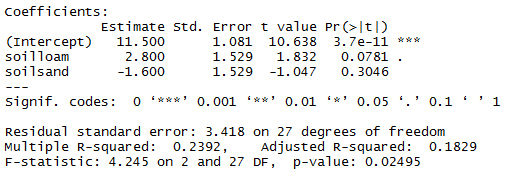</img>
</div>

- This takes the factor level that comes first in the alphabet (here "clay") as the reference level


---  .class #id 

## Interpretation of ANOVA results:  
```{r, eval=F}
summary.lm(aov(yield~soil,data=yields))
```

<div style='text-align: center;'>
    </img>
</div>

- The effect sizes (i.e. means) of the other factors are then expressed as deviations from this reference level:
```{r}
with(yields, tapply(yield, soil, mean) - mean(yield[soil=="clay"]))
```


---  .class #id 

## Interpretation of ANOVA results:  
```{r, eval=F}
summary.lm(aov(yield~soil,data=yields))
```

<div style='text-align: center;'>
    </img>
</div>

- The first row (Intercept) is a mean, so the standard error column in row 1 contains the standard error of a mean. Rows 2 and 3 are differences between means, so their standard error columns contain the **standard error of the difference between two means** (which is a bigger number):
<div style='text-align: center;'>
    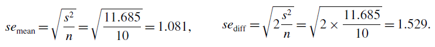</img>
</div>

---  .class #id 

## Interpretation of ANOVA results:  
```{r, eval=F}
summary.lm(aov(yield~soil,data=yields))
```

<div style='text-align: center;'>
    </img>
</div>

- The **t value** is calculated as: *Estimate/std. error*:
```{r}
11.5/1.081;    2.8/1.529;    -1.6/1.529
```

---  .class #id 

## Interpretation of ANOVA results:  
```{r, eval=F}
summary.lm(aov(yield~soil,data=yields))
```

<div style='text-align: center;'>
    </img>
</div>

- The only remaining issue is whether **sand** soils yielded significantly less than **loam**. The difference between
these two means was $2.8-(-1.6)=4.4$ and so the *t value* is $4.4/1.529=2.878$. This is greater than 2 (the rule of thumb for *t*) so the mean yields of loam and sand seem to be  significantly different. To find the precise *p* value:
```{r}
2*(1 - pt(2.878, df = 18))
```


---  .class #id &twocol

## Plotting ANOVA results:

- Nice way of plotting the data using *ggplot*:

*** =left

```{r, eval=F}
sumDat <- yields %>% 
  group_by(soil) %>%
    summarise(yield = mean(yield))

p<- ggplot(yields, aes(x=soil,y=yield)) + 
        geom_point(size=5, shape=21, 
                   fill="grey") + 
        theme_bw() + 
        theme(axis.title=element_text
              (size=20)) +
        theme(axis.text=element_text
              (size=16)) +
        coord_flip() 
p + geom_point(data=sumDat, size=12, 
               shape=18)


```
*** =right

```{r, echo=F}
sumDat <- yields %>% 
  group_by(soil) %>%
    summarise(yield = mean(yield))

p<- ggplot(yields, aes(x=soil,y=yield)) + 
        geom_point(size=5, shape=21, 
                   fill="grey") + 
        theme_bw() + 
        theme(axis.title=element_text
              (size=20)) +
        theme(axis.text=element_text
              (size=16)) +
        coord_flip() 
p + geom_point(data=sumDat, size=12, 
               shape=18)


```

---  .class #id &twocol

## Plotting ANOVA results:

- An alternative way to plot the data is as a bar-plot with error bars (preferred by many journals)
- No simple way of doing this in R (at least in base R)...
- Here's a function from Crawley R book:
```{r}
error.bars<-function(yv,z,nn) {
xv<-
barplot(yv,ylim=c(0,(max(yv)+max(z))),names=nn,ylab=deparse(substitute(yv)
))
g=(max(xv)-min(xv))/50
for (i in 1:length(xv)) {
lines(c(xv[i],xv[i]),c(yv[i]+z[i],yv[i]-z[i]))
lines(c(xv[i]-g,xv[i]+g),c(yv[i]+z[i], yv[i]+z[i]))
lines(c(xv[i]-g,xv[i]+g),c(yv[i]-z[i], yv[i]-z[i]))
}}
```


---  .class #id &twocol

## Plotting ANOVA results:

- Need to decide on what type of error bars. 
- E.g. could use the **standard error of a mean** based on the pooled error variance from the ANOVA.
- From previous ANOVA table we found that the pooled error variance $s^2 = 11.685$
- There was equal replication (n=10) per factor level, which makes life easier, so the standard error of a mean is $\sqrt(s^2/n) = \sqrt(11.685/10) = 1.081$
- We shall draw an error bar up 1.081 from each mean and down by the same distance, so we need 3 values
for z, one for each bar, each of 1.081:

```{r}
se<-rep(1.081,3)
```
- And we need to provide labels for the five different bars: the factor levels should be good for this:
```{r}
labels<-as.character(levels(yields$soil))
```

---  .class #id &twocol

## Plotting ANOVA results:

*** =left
- Now we work out the five mean values which will be the heights of the bars, and save them as a vector called *Yield*:
```{r}
Yield<-
  as.vector(with(yields, 
           tapply(yield,soil,mean)))
```
- Finally, we can create the barplot with error bars:
```{r, eval=F}
error.bars(Yield,se,labels)
```

*** =right
<div style='text-align: center;'>
    </img>
</div>

---  .class #id 

## Important note about error bars!!

- If we use standard error of the means: *when the bars overlap this implies that the two means are not significantly different*
- Because remember the rule of thumb for *t*: significance requires 2 or more standard errors, and if the bars overlap it means that the difference between the means is *less than* 2 standard errors.
- **PLUS:** when comparing means, we should use the **standard error of the difference between two means** (not the standard error of one mean) in our tests; these bars would be about 1.4 times as long as the bars we have drawn here!
- So we cannot easily conclude that *non-overlapping error bars* = significant difference! 
- Alternativley we could use 95% confidence intervals for the lengths of the bars, which roughly = 2*SE
- **But...** if it were the case that the error bars *did not overlap* when we are using confidence intervals, then that would imply that the means differed by more than **4 standard errors**, and this is a much greater difference than is required to conclude that the means are significantly different...

---  .class #id 

## Solution = use least significant difference (LSD) bars!

- Let's revisit the formula for Student's *t* test:

<div style='text-align: center;'>
    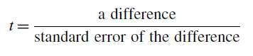</img>
</div>

- We say that the difference is significant when *t*>2 (by the rule of thumb, or *t>qt(0.975,df)* if we want to be more precise). 
- We can rearrange this formula to find the smallest difference that we would regard as being significant, and call this *the least significant difference*:

<div style='text-align: center;'>
    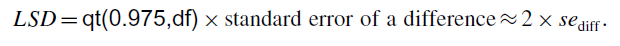</img>
</div>

- So, we want overlapping bars to indicate a difference less than this *LSD*
- Therefore we need to draw bars that are *LSD*/2 in length

---  .class #id &twocol

## Solution = use least significant difference (LSD) bars!

*** =left
```{r,eval=F}
lsd<-qt(0.975, 18)*sqrt(2*11.685/10)
lsdbars<-rep(lsd,3)/2
error.bars(Yield,lsdbars,labels)
```

*** =right
```{r,echo=F}
lsd<-qt(0.975, 18)*sqrt(2*11.685/10)
lsdbars<-rep(lsd,3)/2
error.bars(Yield,lsdbars,labels)
```

---
