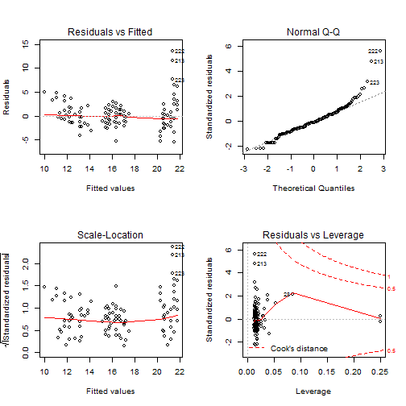

## Resources


--- .class #id 
## Resources


--- .class #id 


## Multiple Regression
### Defined
In multiple regression we have a continuous response variable and two or more continuous
explanatory variables. 

\[Y_i  = \beta_0 + \beta_1 X_1 + \beta_2 X_2 + ...+ \beta_k X_k\]

Some issues with multiple regression:

* the explanatory variables are often correlated with one another
* there might be interactions between explanatory variables

Remember parsimony - if a simpler model explains your data just as well as more complex model pick the simple one.


--- .class #id 
## Multiple Regression
### Example

Abundances of around 75 invertebrate species from 45 sites were measured on various beaches along the Dutch coast. We want to see if a suite of environmental data can explain species richness. 

We have 5 explanatory variables including the variable "NAP" which measured the height of the sample site compared with average sea level, and indicated the time a site is under water. Week is fitted as a nominal variable. 


\[richness  = \beta_0 + \beta_1 * NAP + \beta_2*grainsize + \beta_3*hummus + week + \\\beta_4 * angle + \epsilon\]

--- .class #id 
## Multiple Regression
### What do the data look like?


Take a look at correlations between variables


```r
plot(rich)
```

--- .class #id 
## Multiple Regression
### Fit a model using lm


```r
model1<-lm(Richness ~ NAP+grainsize+humus+factor(week) + angle2, 
                 data = rich)
summary(model1)
```

--- .class #id 
## Multiple Regression 
### Interpreting the regression parameters
$\beta_1$ shows the change in species richness for a one-unit change in NAP, while keeping all other variables constant. 

--- .class #id 
## Multiple Regression
### Model selection
One aim of regression modelling is to find the optimal model that identifies the parameters that best explain the collected data.

Akaike Information Criteria (AIC) and adjusted $R^2$ are often used to select between models. 

--- .class #id 
## Multiple Regression 
### Model selection - AIC

\[AIC= nlog(SS_{residual})+2(p+1)-nlog(n)\]

The first part of the AIC definition is a measure of goodness of fit. The second
part is a penalty for the number of parameters in the model. The lower the AIC the better. AIC values need to be compared to other models, they're not really interpretable on their own. A rule of thumb is that a difference in AIC > 2 is an improvement.

--- .class #id 
## Multiple Regression 
### Model selection - adjusted R^2

\[adjusted\,\, R^2=1-\frac{SS_{residual}/(n-(p+1))}{SS_{total}/n-1}\]

where p is the number of parameters in the model and n is the sample size

The disadvantage of $R^2$ is
that the more explanatory variables are used, the higher the $R^2$ The adjusted $R^2$
accounts for different degrees of freedom and, hence, the extra regression parameters. The higher the adjusted $R^2$ the better.

--- .class #id 
## Multiple Regression 
### Model selection
Rather than selecting explanatory variables randomly there are automatic procedures in R. 

* Forward selection - start from simplest and move to complex based on AIC
* Backward selection - start from most complex and move to simple based on AIC
* Combination - do both based on AIC

--- .class #id 
## Multiple Regression 
### Backward selection

```r
max.model <- lm(Richness~NAP+grainsize+humus+factor(week) + angle2,data=rich)
step(max.model, direction = "backward")
```

### Forward selection

```r
min.model = lm(Richness ~ 1, data=rich)
max.model <- formula(lm(Richness~NAP+grainsize+humus+factor(week) + angle2,data=rich))
step(min.model, direction = "forward",max.model)
```

### Both ways selection

```r
min.model = lm(Richness ~ 1, data=rich)
max.model <- formula(lm(Richness~NAP+grainsize+humus+factor(week) + angle2,data=rich))
step(min.model, direction = "both",max.model)
```

--- .class #id 
## Multiple Regression 
### Inerpret and plot our final model 

```r
intercepts <- c(coef(model1)["(Intercept)"],
                coef(model1)["(Intercept)"] + coef(model1)["factor(week)2"],
                coef(model1)["(Intercept)"] + coef(model1)["factor(week)3"],
                coef(model1)["(Intercept)"] + coef(model1)["factor(week)4"])

lines.df <- data.frame(intercepts = intercepts,
                       slopes = rep(coef(model1)["NAP"], 4),
                       week = levels(factor(rich$week)))

qplot(x = NAP, y = Richness, color = factor(week), data = rich) + 
  geom_abline(aes(intercept = intercepts, 
                  slope = slopes, 
                  color = week), data = lines.df)
```


--- .class #id 
## Multiple Regression 
### Inerpret and plot our final model 


--- .class #id 
## Multiple Regression 
### Model selection - warning about algorithms

* It yields R-squared values that are badly biased to be high.
* It has severe problems in the presence of collinearity.
* Increasing the sample size does not help very much
* It allows us to not think about the problem, i.e. encourages data dredging 

--- .class #id 
## Multiple Regression 
### Model selection - warning about algorithms


```r
set.seed(1)
N <- 200000
y <- rnorm(N)
x1 <- y + rnorm(N)
x2 <- y + rnorm(N)
x3 <- y + rnorm(N)
x4 <- rnorm(N)
x5 <- rnorm(N)
x6 <- x1 + x2 + x3 + rnorm(N)
data <- data.frame(y, x1, x2, x3, x4, x5, x6)
fit1 <- lm(y ~ ., data)
fit2 <- lm(y ~ 1, data)
back<-step(fit1,direction="backward")
forward<-step(fit2,direction="forward",scope=list(upper=fit1,lower=fit2))
both<-step(fit2,direction="both",scope=list(upper=fit1,lower=fit2))
```

--- .class #id 
## Multiple Regression 
### Multicolinearity
If some of the explanatory variables in a multiple regression analysis are highly correlated with one another, this is called collinearity or multicollinearity. This means that choosing the best subset of explanatory variables may be difficult

--- .class #id 
## Multiple Regression 
### Multicolinearity - Variance inflation factors
Collinearity can be detected by calculating the variance inflation factor (VIF)
for each explanatory variable

\[VIF_i=\frac{1}{1-R^2_i}\]

where $R^2_i$ is the coefficient of determination you get from regressing the
each of the explanatory variable against all the other explanatory variables. 

If it is uncorrelated with all the others then VIF = 1. VIF increases as the correlation
increases. Worry if $VIF > 5$

--- .class #id 
## Multiple Regression 
### Multicolinearity - Variance inflation factors


```r
library(car)
vif(fit1)
```

```
##        x1        x2        x3        x4        x5        x6 
##  3.514338  3.501349  3.501065  1.000042  1.000038 13.023041
```

```r
vifTest<-lm(x6~x1+x2+x3+x4+x5,data=data)
summary(vifTest)$r.squared
```

```
## [1] 0.923213
```

```r
1/(1-0.923213)
```

```
## [1] 13.02304
```

--- .class #id 
## Multiple Regression
### Multicolinearity
One potential solution to multicolinearity is to combine the colinear explanatory variables using a principal components analysis. Alternatively if two variables are extremely correlated, you can drop one of them because they are telling you the same thing. 


--- .class #id 
## Multiple Regression 
### Interactions - it depends
Interaction effects occur when the effect of one variable depends on the value of another variable. 

If someone asks you, "Do you prefer ketchup or chocolate sauce on your food?" You'll say it depends on the type of food! That 'it depends' is the nature of an interaction effect. 

--- .class #id 
## Multiple Regression 
### Interactions - it depends

```r
# Load the Interactions_Categorical data
food<-read.csv("C:\\Users\\akane\\Desktop\\Science\\Teaching\\BL6024_UCC_2017\\Lecture 05\\assets\\img\\Interactions_Categorical.csv")
intCat<-lm(Enjoyment~Food*Condiment,data=food)
```

--- .class #id 
## Multiple Regression - interactions
### Interactions - it depends

```r
interaction.plot(x.factor = food$Food, 
                  trace.factor = food$Condiment,
                  response = food$Enjoyment,ylab="enjoyment")
```


--- .class #id 
## Multiple Regression - interactions
### Dangerous to overlook interaction effects

Based on these plots, we would choose hot dogs with chocolate sauce because they each produce higher enjoyment. 


--- .class #id 
## Multiple Regression 
### What do interactions of continuous variables look like?


```r
set.seed(1)
x1 <- runif(100, 0, 1)
x2 <- sample(1:10, 100, TRUE)/10
y <- 1 + 2 * x1 + 3 * x2 - 10 * x1 * x2 + rnorm(100)
m.int <- lm(y ~ x1 * x2)
```

--- .class #id 
## Multiple Regression 
### What do interactions of continuous variables look like?


```r
library(rsm)
persp(m.int, x1 ~ x2, zlab = "y",col = rainbow(50), contours = "colors",
      theta = 120, phi = 15,ticktype="simple")
```


--- .class #id 
## Multiple Regression - interactions
### Without the interaction


```r
set.seed(1)
x1 <- runif(100, 0, 1)
x2 <- sample(1:10, 100, TRUE)/10
y <- 1 + 2 * x1 + 3 * x2 + rnorm(100)
m.int2 <- lm(y ~ x1 + x2)
```


--- .class #id 
## Multiple Regression - interactions
### Without the interaction


```r
library(rsm)
persp(m.int2, x1 ~ x2, zlab = "y",col = rainbow(50), contours = "colors",
      theta = 35, phi = 15,ticktype="simple")
```


--- .class #id
## GLMs 
### Normality
In ecological research we typically only get one value of y per x e.g. one measurement of height per age. We then assume the data point we have comes from a normal distribution. 

When we fit the regression line it is as if it is running through a load of normal distributions, one for each x data point. Because the line won't fit through the points perfectly we're left with some residual variance around it. That's what we mean when we say the residuals are normally distributed. 

--- .class #id
## GLMs 
### Normality


--- .class #id
## GLMs
### LM to GLM
Linear models assume that your residuals:
* are normally distributed and 
* have constant variance. 

--- .class #id 
## GLMs
### Normally distributed data with constant variance


--- .class #id 
## GLMs
### Artificially messy data


--- .class #id 
## GLMs
### Real world data


--- .class #id 
## GLMs 
### When simple LMs aren't up to the job
Generalized linear models enable you to fit models to data that don't meet the requirements of normality and equal variance in your residuals. 

--- .class #id 
## GLMs 
### Types of data GLMs can handle
Specifically, you should use GLMs when the response variable is:

* count data expressed as proportions (e.g. logistic regressions);
* count data that are not proportions (e.g. log-linear models of counts);
* binary response variables (e.g. dead or alive);
* data on time to death where the variance increases faster than linearly with the mean (e.g. time data with gamma errors).

--- .class #id 
## GLMs 
### Properties 
A generalized linear model has three important properties:

* the error structure;
* the linear predictor;
* the link function.

--- .class #id 
## GLMs 
### The error structure - random component
You may specify a variety of different error distributions with a GLM:

* Poisson errors, useful with count data;
* binomial errors, useful with data on proportions;
* gamma errors, useful with data showing a constant coefficient of variation;
* exponential errors, useful with data on time to death (survival analysis).

--- .class #id 
## GLMs 
### The linear predictor - systematic component 

This specifies the explanatory variables ($X_1, X_2, ... X_k$) in the model, more specifically their linear combination in creating the so called linear predictor; e.g., the linear prediction function is equal to $\beta_0 + \beta_1x_1 + \beta_2x_2 + \beta_kx_k$ as we have seen in linear regression.

--- .class #id 
## GLMs 
### The link function
The link function specifies the link between the random (error structure) and systematic components (linear predictor). It says how the expected value (the mean) of the response (your y value) relates to the linear predictor of explanatory variables

--- .class #id 
## GLMs 
### The link function 
 An important criterion in
the choice of link function is to ensure that the fitted values stay within reasonable
bounds. We would want to ensure, for example, that counts were all greater than or
equal to zero (negative count data would be nonsense). 

Similarly, if the response variable was the proportion of individuals who died, then the fitted values would have to lie between 0 and 1 (fitted values greater than 1 or less than 0 would be meaningless).

--- .class #id 
## GLMs 
### Probability distribution centric convention
Strange to think of the stochastic parts of the model as errors. E.g., say you are looking at the relation between height and weight by running a linear regression with height as the predictor and weight as the outcome, where is the error in this model? 

Using the error term convention the difference between the resulting regression line and the weights would be labeled as the error. But isn’t it strange to talk about the fact that there is variability in how much people weigh, given their height, as an error? 

Using the distribution centric notation this difference is seen more like a part of the actual model rather than a nuisance measurement error.

--- .class #id 
## GLMs 
### Probability distribution centric convention
Instead of this:
\[y_i=\beta_0+\beta_1 x_i + \epsilon_i\]
\[\epsilon_i \sim Normal (0,\sigma^2)\]
we could write the regression equation as this:
\[y_i\sim Normal (\mu_i,\sigma^2)\]
\[\mu_i=\beta_0+\beta_1 x_i\]

--- .class #id 
## GLMs 
### Ice-cream example
Does the number of icecreams sold vary with temperature?


```r
# load in the icecream data file
icecream<-read.csv("C:\\Users\\akane\\Desktop\\Science\\Teaching\\BL6024_UCC_2017\\Lecture 05\\assets\\img\\icecream.csv")
```

--- .class #id 
## GLMs 
### Plot it


--- .class #id 
## GLMs 
### Fit a GLM with family=gaussian
We're arguing that the observation $y_i $was drawn from a Normal (aka Gaussian) distribution with a mean $\mu_i$, depending on the temperature $x_i$ and a constant variance $\sigma^2$ across all temperatures. 

If we think in terms of distributions our model looks like this:
\[y_i\sim N(\mu,\sigma^2)\]
\[E[y_i]=\mu_i=\beta_0+\beta_1 x_i\]

We use the *GLM* command in R and we set the family to gaussian because we're assuming normally distributed errors. The link function linking the error structure to the linear predictor is called the identity function because we don't need to transform the relationship, it's already on a linear scale. 

--- .class #id 
## GLMs 
### Model interpretation

```r
model1 <- glm(units ~ temp, data=icecream, 
              family=gaussian(link="identity"))
summary(model1)
```

--- .class #id
## GLMs 
### Model interpretation
What this tells us is that: 
$y_i\sim N(\mu_i,\sigma^2)$ where $\mu_i = -159.5 + 30.1x_i$

Therefore, when it's 20 degrees out we'd expect to sell $-159.5 + 30.1*20 = 442.5$ units of ice-cream. 

--- .class #id
## GLM with normal errors cont.
### what are these deviance measures?
Deviance is a measure of goodness of fit of a model. Higher numbers always indicate bad fit. It is just the sum of square errors when you use family = gaussian().

The null deviance shows how well the response variable is predicted by a model that includes only the intercept (grand mean) whereas the residual deviance takes into account the independent variables.

You can see that the addition of 1 (11-10 = 1) independent variable decreased the deviance from 174755 to 14536. The Residual Deviance has reduced by (174755 - 14536 = 160219) with a loss of one degree of freedom.

If your Null Deviance is really small, it means that the Null Model explains the data pretty well. Likewise, with your Residual Deviance.

--- .class #id 
## GLM with normal errors cont. 
### what are these deviance measures?

```r
interceptOnly <- glm(units ~ 1, data=icecream, 
              family=gaussian(link="identity"))
summary(interceptOnly)
```


--- .class #id
## GLMs 
### Problems with our model choice 
When it's 20 degrees out we'd expect to sell $-159.5 + 30.1*0 = -159.5$ units of icecream. 

That doesn't make much sense. The intercept is at -159, which would mean that customers return on average 159 ice creams on a freezing day. Perhaps a different conditional distribution for our y data would work better here because we're dealing with count data. 

--- .class #id 
## GLMs 
### Count data
Count data are whole numbers (integers) so that when the mean is low, the data are likely to consist only of zeros, ones and twos, with the odd three of four thrown in. This being the case, the variance of count data is bound to be low when the mean is low.

However, when the mean of count data is high, the range of individual counts can be from
zero to potentially very large numbers, so we can expect to obtain a  high variance. 

For count data, therefore, the variance is expected to increase with the mean, rather than being constant as assumed in previous linear models.

--- .class #id 
## GLMs 
### Count data
Straightforward linear regression methods (assuming constant variance and normal
errors) are not appropriate for count data for four main reasons:
* the linear model might lead to the prediction of negative counts
* the variance of the response variable is likely to increase with the mean
* the errors will not be normally distributed
* zeros are difficult to handle in transformations

--- .class #id 
## GLMs 
### Count data - link function 
The Poisson distribution has only one parameter, here $\mu_i$, which is its expected value or mean. The link function for $\mu_i$ is the logarithm, i.e. the logarithm of the expected value is regarded as a linear function of the predictors. 

The advantage of the log link is that the fitted values are always positive, regardless of the values of the covariates and the estimated regression parameters.

But this means you have to use exponentiation (the reverse of logs) to get back to the original scale.

--- .class #id 
## GLMs 
### Count data
The model looks like this:
\[y_i\sim Poisson(\mu_i)\]
\[E[y_i]=\mu_i=exp(\beta_0+\beta_1 x_i)\]
\[log(\mu_i)=\beta_0+\beta_1 x_i\]

--- .class #id 
## GLMs 
### Create our model for count data
In R we define this model using family = poisson and supplying the link function which is the log. 

```r
model2 <- glm(units ~ temp, data=icecream, 
              family=poisson(link="log"))
```

We can also simply specify the family and by default R will use the log link function. 


```r
model2 <- glm(units ~ temp, data=icecream, 
              family=poisson)
```

--- .class #id 
## GLMs 
### Interpreting our results 
Remember we have to exponentiate these parameter values to get them back on a familiar scale because of the following:

\[y_i\sim Poisson(\mu_i)\]
\[E[y_i]=\mu_i=exp(\beta_0+\beta_1 x_i)\]
\[log(\mu_i)=\beta_0+\beta_1 x_i\]

If we do so, how many ice creams do we predict will be sold at $0^0C$?


```r
exp(4.543821 + 0.075595 * 0 )
```

```
## [1] 94.04948
```

--- .class #id 
## GLMs
Interpreting the slope alone. 

```r
exp(0.075595) - 1
```

```
## [1] 0.07852568
```

For a one unit change in temperature there is an approximate 8% increase in icecreams sold. 

--- .class #id 
## GLMs
### Another dataset - Fish abundance at different depths 

```r
# load in the Fish data file 
Fish <- read.table("C:\\Users\\akane\\Desktop\\Science\\Teaching\\BL6024_UCC_2017\\Lecture 05\\assets\\img\\Fish.txt",header = T)
head(Fish,3)
```

```
##   Site TotAbund        Dens MeanDepth Year Period       Xkm       Ykm
## 1    1       76 0.002070281     0.804 1978      1  98.75575 -57.46692
## 2    2      161 0.003519799     0.808 2001      2  76.80388 178.64798
## 3    3       39 0.000980515     0.809 2001      2 103.79283 -50.05184
##   SweptArea
## 1  36710.00
## 2  45741.25
## 3  39775.00
```

--- .class #id 
## GLMs
### Plot our data 


--- .class #id 
## GLMs
### What's an appropriate model? One with Normal errors?

\[Abundance_i \sim \beta_1 + \beta_2 Mean\,Depth_i +\epsilon_i\]
\[\epsilon_i\sim N(0,\sigma^2)\]


```r
m1 <- glm(TotAbund~MeanDepth,data=Fish)
```

--- .class #id 
## GLMs
### What do our diagnostic plots look like?


--- .class #id 
## GLMs
### Model fit with simulated normal curves of total abundance superimposed


--- .class #id 
## GLMs
### Let's fit a GLM with family = Poisson


```r
m1 <- glm(TotAbund~ MeanDepth, data= Fish, family = poisson)
```

--- .class #id 
## GLMs
### Interpret the model
Draw out the regression equation and input the parameter values from the model output:

\[log(\mu_i)=6.643-0.628*Mean\,\,depth\]

\[\mu_i=e^{log(\mu_i)}=e^{6.643-0.628*Mean\,depth}\]


--- .class #id 
## GLMs
### Plot the fitted line 


```r
par(mar = c(5,5,2,2))
# pick the min and max depths and create a vector of length 25 with equally spaced values
MyData <- data.frame(MeanDepth = seq(0.804, 4.865, length = 25))
# predict function fills in the predicted y data along the curve 
P1 <- predict(m1, newdata = MyData, type = "response")
plot(x = Fish$MeanDepth,
     y = Fish$TotAbund,
     ylim = c(0,1300),
     xlab = "Mean depth (km)",
     ylab = "Total abundance values", cex.lab = 1.5)
     
lines(MyData$MeanDepth, P1, lwd = 3)
```

--- .class #id 
## GLMs
### Plot the fitted line 


--- .class #id 
## GLMs
### Plot simulated values from Poisson distribution with mean given by line


--- .class #id 
## GLMs
### Pseudo R^2
We don't have a $R^2$ in GLM models; the closest we can get is the explained deviance, which is calulated as: 

\[100 *  \frac{null\,\,\,\,deviance-residual\,\,\,deviance}{null\,\,\,\,deviance}\]


```r
100* ((m1$null.deviance-m1$deviance) / m1$null.deviance)
```

```
## [1] 43.23067
```

--- .class #id 
## GLMs
### Model validation 
Let's look at Pearson residuals which work well for GLMs. They're just standardised residuals. Whereas regular residuals are defined as the observed values minus the fitted values:
\[\epsilon_i=TotAbund_i-\mu_i\]
The Pearson residuals are calculated by:
\[\epsilon_i=\frac{TotAbund_i-\mu_i}{\sqrt{variance(TotalAbund_i)}}\]
Note, that we're not looking for normality in the Pearson residuals, the issue is lack of fit. The phrase 'Poisson errors' should not be used as errors are not Poisson distributed. 


```r
E1<-resid(m1,type="pearson")
```

--- .class #id 
## GLMs
### Model validation 

```r
E1<-resid(m1,type="pearson")
F1<-fitted(m1)
eta<-predict(m1,type="link")
plot(x = eta, 
     y = E1,
     xlab = "Fitted values",
     ylab = "Pearson residuals",
     cex.lab = 1.5)
abline(h=0, v = 0, lty = 2)
```


--- .class #id 
## GLMs
### Clear increase in variation for larger fitted values


--- .class #id 
## GLMs
### Overdispersion
This is extra, unexplained variation in the response than would be expected based on your statistical model of choice, here the Poisson model. Reasons include:
* Model is missing a required explanatory variable 
* Model has outliers
* Model requires interaction terms
* Explanatory variables are not on the right scale, e.g. log scale
* A continuous covariate has a non-linear effect
* Model has the wrong link function
* There is zero-inflation
* There is some dependency structure in the data
In many cases overdispersion affects model coefficients. We can test for overdispersion by seeing if the residual deviance is much greater than the residual degrees of freedom. Their ratio should be ~ 1. 

--- .class #id 
## GLMs
### Overdispersion - causes?

```r
m1 <- glm(TotAbund~ MeanDepth, data= Fish, family = poisson)
deviance(m1) / df.residual(m1)
```

```
## [1] 109.5122
```

--- .class #id 
## GLMs
### Overdispersion - causes?

```
##   Site TotAbund        Dens MeanDepth Year Period       Xkm       Ykm
## 1    1       76 0.002070281     0.804 1978      1  98.75575 -57.46692
## 2    2      161 0.003519799     0.808 2001      2  76.80388 178.64798
## 3    3       39 0.000980515     0.809 2001      2 103.79283 -50.05184
## 4    4      410 0.008039216     0.848 1979      1  91.53227 146.44797
## 5    5      177 0.005933375     0.853 2002      2 107.14419 -37.07544
## 6    6      695 0.021800502     0.960 1980      1  86.56470 -48.19807
##   SweptArea
## 1  36710.00
## 2  45741.25
## 3  39775.00
## 4  51000.00
## 5  29831.25
## 6  31880.00
```

--- .class #id 
## GLMs
### Overdispersion - causes?
The data were collected during two different periods (1979-1989 & 1997-2002) so that may be important to consider. 

There may be an interaction between depth and time period so we should test to see if that affects our overdispersion measure as well. 

\[TotAbund_i \sim Poisson(\mu_i)\]
\[log(\mu_i)=\beta_1+\beta_2 Mean\,\,depth + \beta_3 Period_i + \beta_4 Mean\,\,depth_i *Period\]


--- .class #id 
## GLMs
### Include time period as a factor and the interaction term

```r
# classify period as a factor variable 
Fish$fPeriod <- factor(Fish$Period)
m2 <- glm(TotAbund~ MeanDepth * fPeriod, data= Fish, family = poisson)
summary(m2)
```

--- .class #id 

## GLMs
### Model interpretation
We now have two lines with different intercepts and slopes. 
\[Period1:log(\mu_i)=6.832-0.658*Mean\,\,depth_i\]
\[Period2:log(\mu_i)=6.832-0.674+(-0.658+0.115)*Mean\,\,depth_i\]

Hasn't improved our overdispersion problem though!

```r
deviance(m2) / df.residual(m2)
```

```
## [1] 100.6549
```

--- .class #id 
## GLMs
### Offsets
Counts can be considered as rates at which events occur within areas of different sizes or as time periods of differing duration. We should adjust for this in our model. We want to adjust the total number of fish per site (TotAbund) by the size of the site, (SweptArea). 

Our standard predictor looks like this:

\[log(\mu_i)=\beta_1+\beta_2X_i\]

Adding an offset looks like this:

\[log(\mu_i/t)=\beta_1+\beta_2X_i\]

which is equivalent to this: 

\[log(\mu_i)=\beta_1+\beta_2X_i+log(t)\]

--- .class #id 
## Overdispersion
### Offsets

For our example:

\[TotAbund_i \sim Poisson(\mu_i)\]
\[log(\mu_i)=\beta_1+\beta_2*Mean\,\,depth_i+\beta_3*Period\\+\beta_4*Mean\,\,depth_i*Period_i+log(SweptArea)\]

--- .class #id 
## GLMs
### Offsets

```r
Fish$LogSA <- log(Fish$SweptArea)
m3 <- glm(TotAbund~ MeanDepth * fPeriod +offset(LogSA), data= Fish, family = poisson)
summary(m3)
```

Did this fix our overdispersion?

--- .class #id 
## GLMs
### Overdispersion - negative binomial solution
One way to adjust for Poisson overdispersion is to use the negative binomial GLM. We have a clear case where the variance is larger than the mean. A negative binomial GLM can help us here. The link function is still the log, just as in Poisson.  

\[TotAbund_i \sim NB(\mu_i,k)\]

\[log(\mu_i)=\beta_1+\beta_2*Mean\,\,depth_i+\beta_3*Period\\+\beta_4*Mean\,\,depth_i*Period_i+log(SweptArea)\]

--- .class #id 
## GLMs
### Overdispersion - negative binomial solution
We fit the model using the function glm.nb, this function is located in the MASS package. Note we don't use family here. 


```r
require(MASS)
m4 <- glm.nb(TotAbund~ MeanDepth * fPeriod + offset(LogSA), data= Fish)
summary(m4)
```

--- .class #id 
## GLMs
### Overdispersion - negative binomial solution
Has the negative binomial GLM fixed our overdispersion problem?


```r
deviance(m4) / df.residual(m4)
```

--- .class #id 
## GLMs
### Negative binomial - model selection
The interaction from our summary of m4 looks to be non-significant at p = 0.05. We could comapare a model with the interaction to a model without the interaction. Our null is that the regression parameter $\beta_4$ for the interaction term equals 0 and that the deviances are equal. The command drop1 does this in R. 


```r
drop1(m4,test="Chi")
```

--- .class #id 
## GLMs
### Negative binomial - model selection
The results show the p-value is >>> 0.05 so we fail to reject the null that the regression parameter for the interaction term is different from 0. Therefore we can drop it. 

--- .class #id 
## GLMs
### Negative binomial - model selection
Refit the model without the interaction term. 


```r
m5 <- glm.nb(TotAbund~ MeanDepth + fPeriod + offset(LogSA), data= Fish)
summary(m5)
```

--- .class #id 
## GLMs
### Negative binomial - model validation


```r
# Model validation
E1 <- resid(m5, type = "pearson")
F1 <- fitted(m5)
eta <- predict(m5, type = "link")
par(mfrow = c(2, 2), mar = c(5, 5, 2, 2))
plot(x = F1, y = E1, xlab = "Fitted values", ylab = "Pearson residuals", cex.lab = 1.5)
abline(h = 0, v = 0, lty = 2)
plot(x = c(1:146), y = cooks.distance(m5), xlab = "index", ylab = "cooks distance", 
    ylim = c(0:1), cex.lab = 1.5)
plot(x = Fish$MeanDepth, y = E1, xlab = "Mean Depth (km)", ylab = "Pearson residuals", 
    cex.lab = 1.5, pch = 16)
abline(h = 0, v = 0, lty = 2)
boxplot(E1 ~ Period, ylab = "Pearson residuals", data = Fish, cex.lab = 1.5, 
    xlab = "Period")
abline(h = 0, v = 0, lty = 2)
```

--- .class #id 
## GLMs
### Negative binomial - model validation


--- .class #id 
## GLMs
### Negative binomial - model interpretation

\[TotAbund_i \sim NB(\mu_i,1.94)\]

\[Period1: \mu_i=e^{\eta_i}; \eta_i=-3.31-1.01*Mean\,\,depth_i+log(SweptArea_i) \]

\[Period2: \mu_i=e^{\eta_i}; \eta_i=-3.31-0.43-1.01*Mean\,\,depth_i+log(SweptArea_i) \]

--- .class #id 
## GLMs
### Negative binomial - plot the final model


--- .class #id 
## GLMs 
### Binary data

Is honeycomb cell size related to the presence of honeybee parasites? 


```r
# load in the WBees data file
Bees <- read.table("C:\\Users\\akane\\Desktop\\Science\\Teaching\\BL6024_UCC_2017\\Lecture 05\\assets\\img\\WBees.txt",header=T)
head(Bees)
```

```
##   Parasites CellSize
## 1         0    0.424
## 2         0    0.454
## 3         0    0.457
## 4         0    0.468
## 5         0    0.493
## 6         0    0.558
```

--- .class #id 
## GLMs 
### Binary data - plot it 


--- .class #id 
## GLMs 
### Binary data - distribution of our response variable
We're assuming that our $Y_i$ data has a Bernoulli distribution with a probability $\pi_i$ which is a a binomial distribution with 1 independent trial. Remember $\pi$ is the probability of success (y=1) for each trial. 

--- .class #id 
## GLMs 
### Binary data - the link function

The actual parameter (e.g. probability for a binomial response) cannot range from negative infinity to positive infinity, but your predicted parameter will. The identity link function, i.e. the one used for a normally distributed y, gives illogical results, probabilites and realisations that are < 0 and > 1.

We want a link function that transforms the values of our linear predictor $\beta_1+\beta_2*Cell\,\,size_i$ from $(-\infty,\infty)$ to $(0,1)$, since logistic regression predicts probabilities of success, i.e. the mean of Bernoulli distribution.

--- .class #id 
## GLMs 
### Binary data - the link function

We can use odds, defined as:$\frac{probabilty_i}{1-probability_i}$ to get rid of the upper boundary issue e.g. probability of 0.9 = odds of 9.0. We take the log of the odds so we get rid of the lower boundary e.g. log odds of a probability of 0.1 = -2.20. The resulting link function is called the logit. 

--- .class #id 
## GLMs 
### log odds plotted against probabilites 


--- .class #id 
## GLM 
### odds and probabilities 
If the probability of an event is 0.2, then the odds of it occurring are:
\[odds=\frac{0.2}{1-0.2}=0.25\]
the log odds of it occurring are: 
\[log\,\,odds=log(\frac{0.2}{1-0.2})=−1.3863\]
then the probability of it can be reconstructed as:
\[\frac{exp(ln(odds))}{1+exp(ln(odds))}=\frac{exp(1.3863)}{1+exp(1.3863)}\\=\frac{0.25}{1.25}=0.2\]

--- .class #id 
## GLM 
### odds and probabilities 
So we can translate from odds to probability $\pi_i$ as follows:
\[log\frac{\pi_i}{1-\pi_i}=\beta_1+\beta_2X_i \\\frac{\pi_i}{1-\pi_i}=e^{\beta_1+\beta_2X_i}\\
\pi_i=(1-\pi_i)e^{\beta_1+\beta_2X_i}\\
\pi_i=e^{\beta_1+\beta_2X_i}-e^{\beta_1+\beta_2X_i}\pi_i\\\pi_i+e^{\beta_1+\beta_2X_i}\pi_i=e^{\beta_1+\beta_2X_i}\\(1+e^{\beta_1+\beta_2X_i})\pi_i=e^{\beta_1+\beta_2X_i}\\\pi_i=\frac{e^{\beta_1+\beta_2X_i}}{1+e^{\beta_1+\beta_2X_i}}\]

--- .class #id 
## GLM 
### fitting this in R is easy


```r
B1<-glm(Parasites~CellSize, family = binomial,data=Bees)
```


--- .class #id 
## GLM 
### Interpreting results

Both the intercept and the slope are significant so it's a question of putting everything together and getting it on a scale we can understand. 

\[\pi_i=\frac{e^{\eta_i}}{1+e^{\eta_i}} \\ where \,\,\eta_i=-11.245+22.175 * Cell\,\,size_i\]


```r
-11.245+22.175*0.5# odds scale
```

```
## [1] -0.1575
```

```r
exp(-11.245+22.175*0.5) / (1 + exp (-11.245+22.175*0.5))# probability scale
```

```
## [1] 0.4607062
```

--- .class #id 
## GLM 
### Plot the fitted values 


```r
mydata<-data.frame(CellSize=seq(0.35,0.69,length=50))
pred <- predict(B1,newdata=mydata,type="response")
plot(x=Bees$CellSize,y=Bees$Parasites,xlab="cell size", ylab="probability of parasites")
lines(mydata$CellSize,pred)
```


--- .class #id 
## GLM 
### Plot the fitted values 


--- .class #id 
## GLM 
### Plot the fitted values 
Model validation for this sort of data is difficult because we're working with 1s and 0s i.e. binary data. 

