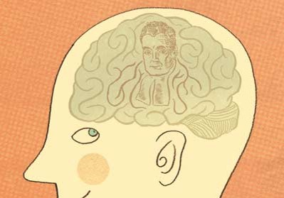
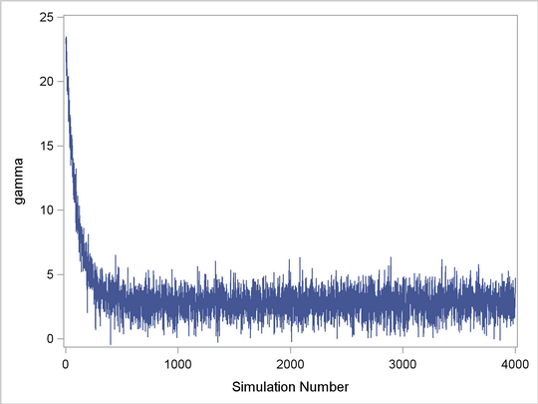
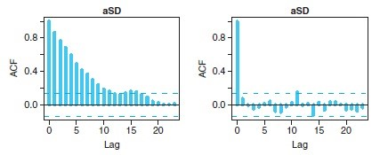

## Contents
 

- A bit of history
 
- Priors and posteriors
 
- Bayesian vs. frequentist
 
- The machinery of Bayesian statistics
 
- Bayesian statistics in R
 
- Practical examples

---  .class #id &twocol

## History of Bayesian statistics
 

*** =left

- **Bayes**' rule

$$ p(x,y) = p(x|y) \times p(y) $$
$$ p(x,y) = p(y,x) $$

*** =right

    </img>

---  .class #id &twocol

## History of Bayesian statistics
 

*** =left

- **Bayes**' rule

$$ p(x,y) = p(x|y) \times p(y) $$
$$ p(x,y) = p(y,x) $$
$$ p(y|x) = \frac {p(x|y) \times p(y)}{p(x)}$$
 

*** =right

    </img>

---  .class #id &twocol

## History of Bayesian statistics
 

*** =left

- **Bayes**' rule

$$ p(x,y) = p(x|y) \times p(y) $$
$$ p(x,y) = p(y,x) $$
$$ p(y|x) = \frac {p(x|y) \times p(y)}{p(x)}$$
 

- Use in statistical inference

*** =right

    </img>

---  .class #id 

## Priors and posteriors
 

$$ \color{darkgreen}{p(\theta|x)} = \frac { \color{darkred}{p(x|\theta)} \times \color{darkorange}{p(\theta)}}{\color{darkblue}{p(x)}}$$
 

Simplified to: \(\color{darkgreen}{Posterior\ distribution} \sim \color{darkred}{Likelihood} \times \color{darkorange}{Prior\ distribution}\)

i.e. we update our prior belief in light of the data to get a posterior distribution for the parameters
 

\(\color{darkblue}{p(x)}\) &rightarrow; Evidence (normalization)

---  .class #id 

## We think Bayesian!
 

    </img>

---  .class #id 

## Bayesian vs. Frequentist
 

**- Both**: data are observed realizations of stochastic systems containing random processes

**- Classical (frequentist) stats:** the quantities used to describe these random processes (parameters) are fixed and unknown constants

**- Bayesian stats:** the parameters are viewed as unobserved realizations of random processes

---  .class #id 

## Bayesian vs. Frequentist
 

**- Both**: data are observed realizations of stochastic systems containing random processes

**- Classical (frequentist) stats:** the quantities used to describe these random processes (parameters) are fixed and unknown constants

**- Bayesian stats:** the parameters are viewed as unobserved realizations of random processes

 

 Estimating a single point vs. a distribution  

---  .class #id 

## Bayesian vs. Frequentist
 

**Uncertainty**:

- **Classical (frequentist) stats**: *frequency of hypothetical replicates*

- **Bayesian stats**: *posterior distribution of a parameter, given the data, the model and the priors*

---  .class #id 

## Bayesian vs. Frequentist
 

**Uncertainty**:

- **Classical (frequentist) stats**: *frequency of hypothetical replicates*

- **Bayesian stats**: *posterior distribution of a parameter, given the data, the model and the priors*

 

  Parameters $\theta$ are random variables &rightarrow; we can make probabilistic statements  

---  .class #id &twocol

## Pros & cons of the Bayesian approach

*** =left
 

- Flexibility and tractability
 
- No asymptotics
 
- Incorporate existing information
 
- Error propagation
 
- Intuitive interpretation

*** =right
 

- Prior choice
 
- Controversies on model selection
 
- Computing times

---  .class #id &twocol

*** =left

 
 
 
 

> &nbsp;
> *The argument in the academic community is mostly esoteric tail wagging anyway*. 

> &nbsp;                                    

> &nbsp;
> *In truth most analysts out of the ivory tower don't care that much, if at all, about Bayesian vs. Frequentist*.

(Rob Balon)

*** =right
 
 
 

    </img>

---  .class #id 

## Bayesian machinery
 

- Problem is the estimation of \(p(x)\):
$$ p(x) = \int p(x,\theta)\  d\theta $$

- *Solution*: approximate inference

---  .class #id 

## Bayesian machinery
 

- Markov Chain Monte Carlo (MCMC) algorithms
- Not the only solution (e.g. INLA)
- *Software*: WinBUGS (OpenBUGS), JAGS, Stan, Nimble, MCMCglmm, ...

 

</img>
</img>
</img>

---  .class #id 

## Example: Gibbs sampler

 

---  .class #id 

## BUGS/JAGS in practice
 

- Define model
- Set priors and constraints
- Compile model based on data
- Initialise chains
- Iterate chains until convergence
- Obtain posterior sample
- Monitor convergence and prior sensitivity
- Model validation and selection

---  .class #id &twocol

## Choosing your priors

*** =left
 

- 
What is a reasonable prior?

 
- 
Uninformative vs. informative

 
- 
 Can have subtle effects in multidimensional cases 

 
- 
Assess prior sensitivity

*** =right

    </img>

    </img>

---  .class #id 

## Convergence monitoring

- *Trace plots and burn-in*

 
 

    </img>

---  .class #id 

## Convergence monitoring

- Trace plots and burn-in
- *Use multiple parallel chains*

    </img>

---  .class #id 

## Convergence monitoring

- Trace plots and burn-in
- Use multiple parallel chains
- *Brooks-Gelman-Rubin (BGR) diagnostic* 

    </img>

---  .class #id 

## Convergence monitoring

- Trace plots and burn-in
- Use multiple parallel chains
- Brooks-Gelman-Rubin (BGR) diagnostic 
- *Density plots*

    </img>

---  .class #id 

## Convergence monitoring

- Trace plots and burn-in
- Use multiple parallel chains
- Brooks-Gelman-Rubin (BGR) diagnostic 
- Density plots
- *Monte Carlo error*

---  .class #id 

## Convergence monitoring

- Trace plots and burn-in
- Use multiple parallel chains
- Brooks-Gelman-Rubin (BGR) diagnostic 
- Density plots
- Monte Carlo error
- *Autocorrelation and thinning*

    </img>

---  .class #id 

## Convergence monitoring

- Trace plots and burn-in
- Use multiple parallel chains
- Brooks-Gelman-Rubin (BGR) diagnostic 
- Density plots
- Monte Carlo error
- Autocorrelation and thinning
- *Effective sample size and posterior summary*

---  .class #id 

## Model validation and selection
 

- Challenging (as in frequentist!)
- Residual diagnostics (for non-hierarchical models)

    </img>

---  .class #id 

## Model validation and selection
 

- Challenging (as in frequentist!)
- Residual diagnostics (for non-hierarchical models)
- Hierarchical models: cross-validation, validation with test data, posterior predictive checks.
- 95% credible intervals and overlap with 0
- Deviance Information Criterion (DIC)
- RJ-MCMC

---  .class #id 

## Example: estimating the mean
 

---  .class #id 

## Example: is the coin fair?
 

---  .class #id 

## Example: simple linear regression
 

---  .class #id 

## Practical - Objectives
 

- Estimate the mean, probability of obtaining heads and the parameters of a simple linear regression (using the example from Session XX)

- Familiarise yourself with BUGS language and `R2OpenBUGS` and `coda` packages in `R`

- Compare the results obtain in a frequentist vs. Bayesian setting

---  .class #id 

 
 
 
## Any questions?

---
