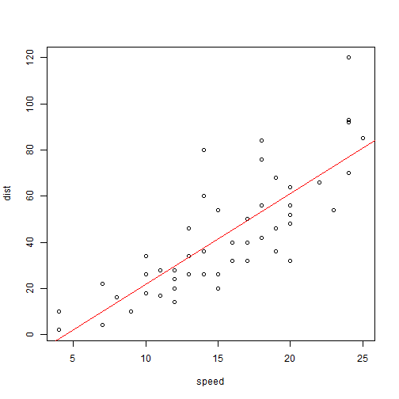

## Read-And-Delete

1. Write using R Markdown
2. Use an empty line followed by three dashes to separate slides!
3. Designate the class of the next slide

--- .class #id 

## R code with output


```r
plot(cars)
abline(lm(dist ~ speed, data = cars), col = "red")
```


--- .class #id 

## R code only


```r
plot(cars)
abline(lm(dist ~ speed, data = cars), col = "red")
```


--- .class #id

## Output only




--- .class #id

## Images

<div style='text-align: center;'>
    </img>
</div>


--- .class #id &twocol

## Two Column Layout   

This slide has two columns. Append `&twocol` to slide separator.
*** =left
- point 1
- point 2
- point 3
*** =right
- point 1
- point 2
- point 3

--- .class #id

## Insert Live Website

<iframe src = 'http://arcaravaggi.github.io' height='600px'></iframe>
